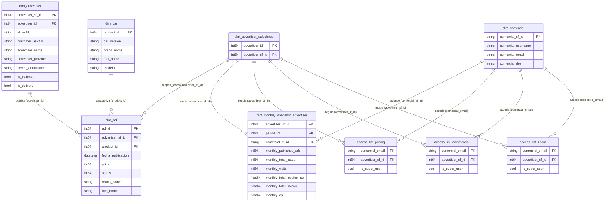
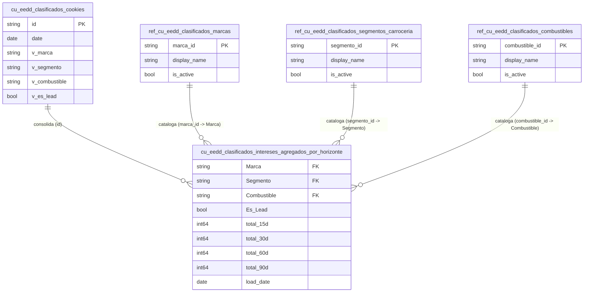

# Modelo de datos — Clasificados

La arquitectura de datos de **Clasificados** en BigQuery procesa la información procedente de los portales de motor (**Autocasión** y **AutoScout24**) y CRM corporativo (**Salesforce**). Se divide en dos esquemas de datos analíticos analizados bajo el proyecto `prj-dataplatform-prod-vocento` para facilitar la gestión comercial, auditoría de leads y perfilado de intenciones de compra.

A continuación, se detallan los diagramas entidad-relación (ER) actualizados según las tablas físicas reales que residen en BigQuery.

---

## 1. Analítica de Anunciantes, Permisos y Facturación (`dm_clasificados`)

Este datamart consolida los anuncios de vehículos unificados con los anunciantes de Salesforce. Adicionalmente, incluye el control de acceso comercial para los analistas de negocio y los snapshots mensuales de rentabilidad y CPL.

!!! tip "🔍 Modelo interactivo"
    Haz clic sobre el diagrama para abrirlo en pantalla completa en una nueva pestaña. Podrás hacer zoom con la rueda del ratón y arrastrar para moverte.

---

## 2. Segmentos e Intereses - Espacio de Datos (`dm_eedd_clasificados`)

Es el esquema analítico encargado de perfilar las intenciones de compra (interés en marcas, combustibles y tipos de carrocería) de los usuarios navegantes. Permite calcular el volumen de leads y búsquedas agregadas por horizontes temporales.

!!! tip "🔍 Modelo interactivo"
    Haz clic sobre el diagrama para abrirlo en pantalla completa en una nueva pestaña. Podrás hacer zoom con la rueda del ratón y arrastrar para moverte.

---

## Orígenes de Datos y Linaje de Clasificados

El linaje de datos de clasificados sigue una segmentación en tres capas de refino:

1. **Pasarelas de Motor & CRM (Capa Bronce)**:
   * Los inventarios físicos de Autocasión y AutoScout24 se cargan diariamente en la capa `bronce_clasificados_raw`.
   * Los maestros de clientes y las carteras de gestores comerciales se ingestan desde Salesforce.
2. **Normalización Silver (`silver_clasificados_refined`)**:
   * Homogeneiza las taxonomías de vehículos (marcas, modelos y combustibles) que difieren entre portales.
   * Realiza la unificación de los identificadores de anunciantes lógicos frente a las cuentas de Salesforce.
3. **Modelado Analítico Gold (`dm_*`)**:
   * **`dm_clasificados`**: Diseña el modelo estrella de anunciantes, campañas y snapshots financieros agregados por mes fiscal para alimentar los paneles directivos.
   * **`dm_eedd_clasificados`**: Agrupa y anonimiza las cookies de comportamiento navegante por horizontes (15, 30, 60 y 90 días) para activar audiencias de motor.

