# Modelo de datos — Clasificados

> El ER siguiente resume el modelo Gold mejor documentado en validaciones, plantillas y drawios.
> No intenta representar todas las tablas de staging/silver.

```mermaid
erDiagram
    DIM_ADVERTISER_SALESFORCE {
        string advertiser_id PK
        string advertiser_sf_id
    }
    DIM_ADVERTISER {
        string advertiser_id PK
        string advertiser_name
    }
    DIM_CAR {
        string product_id PK
        string brand_name
        string fuel_name
    }
    DIM_AD {
        string ad_id PK
        string advertiser_id FK
        string advertiser_sf_id FK
        string product_id FK
    }
    DIM_COMERCIAL {
        string comercial_sf_id PK
        string comercial_email
    }
    ACCESS_LIST_PRICING {
        string advertiser_sf_id FK
        string comercial_email FK
    }
    ACCESS_LIST_COMMERCIAL {
        string advertiser_sf_id FK
        string comercial_email FK
    }
    ACCESS_LIST_ZOOM {
        string advertiser_sf_id FK
        string comercial_email FK
    }
    FACT_MONTHLY_SNAPSHOT_ADVERTISER {
        string advertiser_sf_id FK
        int period_int
        float monthly_total_leads
        float monthly_total_invoice_isc
    }
    REF_CU_CLASIFICADOS_MARCAS {
        string marca_id PK
        boolean is_active
    }
    REF_CU_CLASIFICADOS_SEGMENTOS {
        string segmento_id PK
        boolean is_active
    }
    REF_CU_CLASIFICADOS_COMBUSTIBLES {
        string combustible_id PK
        boolean is_active
    }
    CU_CLASIFICADOS_COOKIES {
        date date
        string id
        string v_marca
        string v_segmento
        string v_combustible
        string v_interes
        boolean v_es_lead
    }
    CU_CLASIFICADOS_INTERESES_AGREGADOS {
        string Marca FK
        string Segmento FK
        string Combustible FK
        string Interes
        boolean Es_Lead
        int total_15d
        int total_30d
        int total_60d
        int total_90d
    }

    DIM_ADVERTISER ||--o{ DIM_AD : advertiser_id
    DIM_ADVERTISER_SALESFORCE ||--o{ DIM_AD : advertiser_sf_id
    DIM_CAR ||--o{ DIM_AD : product_id

    DIM_ADVERTISER_SALESFORCE ||--o{ FACT_MONTHLY_SNAPSHOT_ADVERTISER : advertiser_sf_id
    DIM_ADVERTISER_SALESFORCE ||--o{ ACCESS_LIST_PRICING : permiso_pricing
    DIM_ADVERTISER_SALESFORCE ||--o{ ACCESS_LIST_COMMERCIAL : permiso_comercial
    DIM_ADVERTISER_SALESFORCE ||--o{ ACCESS_LIST_ZOOM : permiso_zoom
    DIM_COMERCIAL ||--o{ ACCESS_LIST_PRICING : comercial_email
    DIM_COMERCIAL ||--o{ ACCESS_LIST_COMMERCIAL : comercial_email
    DIM_COMERCIAL ||--o{ ACCESS_LIST_ZOOM : comercial_email

    CU_CLASIFICADOS_COOKIES ||--o{ CU_CLASIFICADOS_INTERESES_AGREGADOS : agrega
    REF_CU_CLASIFICADOS_MARCAS ||--o{ CU_CLASIFICADOS_INTERESES_AGREGADOS : marca
    REF_CU_CLASIFICADOS_SEGMENTOS ||--o{ CU_CLASIFICADOS_INTERESES_AGREGADOS : segmento
    REF_CU_CLASIFICADOS_COMBUSTIBLES ||--o{ CU_CLASIFICADOS_INTERESES_AGREGADOS : combustible
```

!!! info "Fuentes"
    - `4. Documentación Plataforma Tecnológica\4 - Clasificados\Clasificados - Modelado DW.xlsx`
    - `4. Documentación Plataforma Tecnológica\4 - Clasificados\Informes de validación de datos\Informe de Validación - CdM Clasificados v1.docx`
    - `4. Documentación Plataforma Tecnológica\4 - Clasificados\Avance reunión 2026-02-02\Catálogo modelado de datos.xlsx`
    - `5. Documentación Espacio Datos\2. Casos de uso\CdU Clasificados\Plantilla Metadatos Caso de Uso Clasificados.xlsx`

