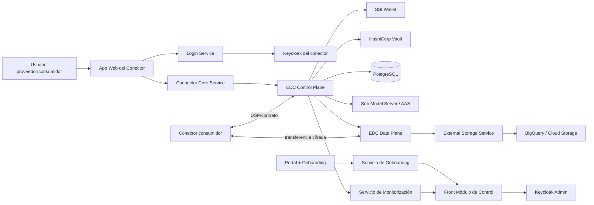

# Arquitectura de la solución desplegada

La arquitectura del EEDD se organiza en **4 capas funcionales** y **18 componentes**.

## Capas

**Capa 1 — Conectividad y datos**

- Conector EDC (Eclipse Dataspace Connector)
- Control Plane
- Data Plane
- Sub Model Server (expone metadatos/activos en formato AAS JSON)

**Capa 2 — Identidad y seguridad**

- Keycloak (OIDC)
- SSI Wallet
- HashiCorp Vault
- PostgreSQL

**Capa 3 — Servicios de negocio**

- Connector Core Service
- External Storage Service
- Login Service
- Servicio de Onboarding
- Únete / Kits
- Servicio de Monitorización

**Capa 4 — Presentación**

- App Web del Conector
- Portal + Onboarding
- Front Módulo de Control
- Front Core

Tecnologías citadas: Eclipse Dataspace Connector, Python/FastAPI, Angular, Keycloak, Vault,
PostgreSQL, AAS, Google Cloud (BigQuery / GCS).

Principios de diseño: **soberanía del dato**, **seguridad por diseño**, **interoperabilidad**,
**trazabilidad**, **escalabilidad**.

## Flujo técnico

Relaciones técnicas clave:

- El **Login Service** autentica contra **Keycloak** y devuelve un JWT al frontal.
- El **Core Service** simplifica la API del conector y aplica lógica de negocio.
- El **Control Plane** negocia políticas/contratos y valida credenciales SSI.
- El **Data Plane** ejecuta la transferencia cifrada de datos.
- El **External Storage Service** integra BigQuery y Cloud Storage para activos externos.
- **Vault** guarda secretos/certificados; **PostgreSQL** persiste políticas, contratos y metadatos.
- El **Servicio de Monitorización** centraliza logs para auditoría.

!!! note
    En algunas notas de formación aparece la grafía "Kicklock/Kiclock"; por contexto técnico y las
    diapositivas fuente, se interpreta como **Keycloak**.

