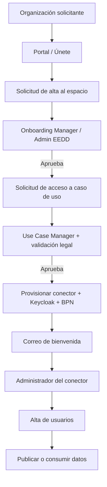

# Definición y modelo operativo del Espacio de Datos (EEDD)

## Qué es el EEDD
El Espacio de Datos (EEDD) de Vocento se describe como un **ecosistema federado y descentralizado**
donde varios participantes comparten e intercambian datos bajo un **marco común de reglas**
(el *Rulebook*), manteniendo la **soberanía del dato en origen**. En la documentación técnica
aparece como **"Espacio de Datos"** / **"Espacio de Datos Federado"**; no se ha localizado una
expansión explícita del acrónimo a "Espacio Europeo/Empresarial de Datos".

Pilares recurrentes en la documentación:

- **Federación** y **descentralización**
- **Confianza y seguridad**
- **Gobernanza común**
- **Soberanía digital** — el proveedor decide quién accede, para qué finalidad, y puede revocar el acceso

El objetivo declarado es **complementar la transformación data-driven** de Vocento con una **capa
de interoperabilidad** para compartir datos con terceros de forma segura y gobernada, con foco en
publicidad, suscripciones, insights y oportunidades comerciales.

## Roles
- **Proveedor de datos** — publica activos/datasets y define políticas de acceso
- **Consumidor de datos** — descubre, solicita y descarga datasets
- **Intermediario / proveedor de servicios**
- **Autoridad de gobierno** — define participantes, conexiones y el Rulebook
- En la operación concreta de Vocento también aparecen: **Administrador del Espacio de Datos**,
  **Onboarding Manager**, **Use Case Manager** y **Administrador del Conector** (gestiona
  identidades en Keycloak, `connector-realm`)

## Ciclo de vida operativo

1. **Alta en el espacio** desde el portal público (3 pasos: datos legales, contactos
   técnico/administrativo/legal, y rol/caso de uso).
2. **Validación administrativa/legal** por el módulo de control.
3. **Solicitud de adhesión** a un caso de uso concreto.
4. **Aprobación y aprovisionamiento**: conector, BPN (identificador) y credenciales Keycloak.
5. **Operación**: descubrir datos (`Discover`, `BPN`, `Available Data`), publicar activos, definir
   políticas, contratar y transferir.
6. **Monitorización/auditoría** de negociaciones y transferencias.
7. **Baja o cambio**, con revocación de credenciales y cese del uso de datos brutos.

La política de acceso por defecto es **restrictiva**: un asset solo lo ve inicialmente quien lo
publica; la visibilidad se abre cuando se asignan políticas/contratos.

## Casos de uso y dominios internos
Los dominios de negocio cubiertos por el EEDD son **Publicidad Digital**, **Clasificados**,
**Suscripciones** e **Inteligencia de Negocio**. La operativa más desarrollada en los materiales
revisados es la de **Publicidad**.

## Hitos del modelo operativo
- **08/05/2026** — Modelo de operación del EEDD entregado y validado.
- **12/05/2026** — Responsables operativos asignados.
- A partir de mayo-junio 2026: identificación de consumidores, política de uso/código de conducta,
  sesiones formativas y comunicación.
- **Junio 2026** — Primer consumidor real en Clasificados (**Renault**); primeras descargas/pruebas.

