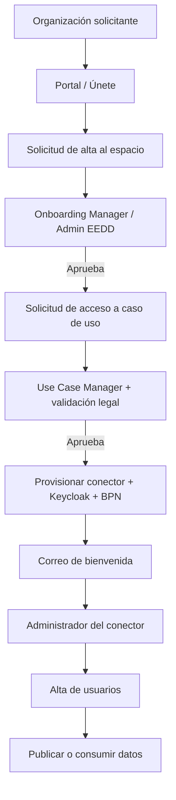

# Formación EEDD

## Manual de usuario
El manual presenta el espacio como una plataforma de intercambio seguro y controlado para
publicar, descubrir y consumir activos de datos con **políticas de acceso** y **contratos
formalizados**.

- Alta de entidad en **3 pasos**: datos legales, contactos (técnico/administrativo/legal) y
  rol/caso de uso.
- Tras el registro: notificación al administrador y correo de confirmación al solicitante.
- **Módulo de Control** (administrador): revisar solicitudes de alta, aceptar/rechazar entidades,
  revisar solicitudes de acceso a casos de uso, asignar nombre de conector, credenciales de
  Keycloak y credenciales operativas del conector.
- Correo de bienvenida: BPN, credenciales de Keycloak, credenciales del conector, enlaces de
  acceso y pasos iniciales.
- **Consumidor**: navega por `Discover`, `BPN` y `Available Data`; consulta proveedores/catálogo;
  descarga activos solo si existe contrato activo y la política lo permite.
- **Proveedor**: publica activos por API o BigQuery; crea políticas sin restricciones o
  restringidas por BPN; crea contratos que vinculan activo + política.
- Identidad: cada conector usa Keycloak; el administrador crea usuarios en `connector-realm` y
  puede ajustar el `Access Token Lifespan`.
- El panel del caso de uso agrupa al menos: `Discover`, `BPN`, `Available Data`, `Mis Datos`,
  `Políticas` y `Contratos`.

Ver arquitectura desplegada completa en [Espacio de Datos > Arquitectura](../espacio-datos/arquitectura.md).

## Formaciones de negocio y herramientas

### Gestión Comercial
Guía del **Analizador de Gestión Comercial**: arquitectura del dashboard en capas (KPIs resumen,
tablas de detalle, desglose colapsable), filtro temporal dinámico, selector de tipo de análisis
(`cartera`, `cierre`, `producción`, `facturación`, `acumulado`), selectores de métricas
personalizadas, +120 filtros segmentados (comercial, soporte, administrativo), exportación desde
cada visual.

### Looker — Funciones básicas
Material operativo: acceso a `https://vocento1.cloud.looker.com/`, navegación por panel
lateral/tableros/carpetas compartidas, filtros básicos/avanzados, `Run` para refrescar,
exportación, programación de envíos (email/Slack), guardado de combinaciones de filtros vía URL,
reporte de incidencias a `csv@vocento.com` (asunto `Looker:` + URL + captura), uso del diccionario
de datos integrado.

### Producción Publicidad Digital
Guía de uso de los dashboards **Publicidad Digital — Diario** y **Mensual** en Looker. Estructura
por hojas: Tendencia, Comparativos, Tops, Analizador. Ejemplos con combinaciones de métricas,
dimensiones, periodos y filtros (cabecera, país, dispositivo, tipo de página, impresiones/clicks).

!!! info "Fuentes"
    - `2. Grabaciones de sesiones\Sesión Telefónica Modelo operativo EEDD\Manual_Usuario_Espacio_Datos_Vocento.docx`
    - `3. Formaciones\Gestión Comercial.pptx`, `Looker_Funciones_Basicas.pptx`, `Prod.Pub.Digital.pptx`
    - `2. Grabaciones de sesiones\Sesiones formativas EEDD\Bloque 1\*`, `Bloque 2\*`, `Bloque 3\*`

