# Modelo entidad-relación técnico

> Este apartado es el corazón técnico del documento. Se ha cruzado `Dataform SQLX`, SQL compilado (`bq_queries_20260210`), `Modelado DW.xlsx` y los SQLX empaquetados de EEDD. En **source** y **staging** predominan vistas; en **data_mart** aparecen tablas con PK lógicas explícitas.

### 01_source / landing (fuentes consumidas por staging)

| Fuente landing | Vista staging descendente | Uso / campos consumidos |
|---|---|---|
| `landing_json_incrementals.advertiser` | `stg_mysql__advertisers` | Anunciantes base de Sumauto: ids, cliente, provincia, nombre, slug, fechas, `salesforce_id`, delivery y contrato/autobiz. |
| `landing_json_incrementals.ad` | `stg_mysql__ads` | Anuncios base: `id`, `province_id`, `advertiser_id`, fechas, `status`, `price`, `product_id`, `kilometers`, `num_imagenes`. |
| `landing_salesforce.cuentas` | `stg_sf__accounts` | Cuentas comerciales: `advertiser_sf_id`, comercial, grupo, estado Sumauto, CIF, teléfono, email, stock y fechas. |
| `landing_salesforce.propuestas` | `stg_sf__proposals` | Cabecera de propuestas/contratos con fechas, tipo, etapa y comercial. |
| `landing_salesforce.productos` | `stg_sf__proposal_products` | Líneas de producto por propuesta: `propuesta_id`, `product_sf_id`, descripción y cantidad. |
| `landing_json_incrementals.zoom_vn_vo` | `stg_mysql_zoom__advertisers__daily` | Métricas diarias por anunciante: ads, llamadas, emails, leads, visitas y paquete. |
| `landing_mongodb_auto_stats.advertiserreport` | `stg_mongo__advertisers__daily` | Reporte diario de anunciante serializado como JSON. |
| `landing_mongodb_auto_stats.adreport` | `stg_mongo__ads__daily` | Reporte diario de anuncio serializado como JSON. |
| `landing_pricing.advertiser_to_cluster` | `stg_advertiser_to_cluster` | Asignación de cluster para pricing. |
| `landing_seeds_drive.seed__listado_provincias` | `stg_seed__listado_provincias` | Catálogo geográfico de referencia. |

**Otras fuentes landing detectadas**: `brand`, `campaign`, `client`, `family`, `fuel`, `product`, `autobiz_prices`, `autotel_record`, `zoom_as24`, `cochesnet`, `wallapop`, `market`, `articles_prices`, múltiples `seed__*` y tablas Salesforce auxiliares.

### 02_staging (43 vistas)

#### Vistas staging clave

- **`stg_mysql__advertisers`** ← `landing_json_incrementals.advertiser`
  - **Columnas**: `advertiser_id` INT64, `client_id` INT64, `province_id` INT64, `advertiser_name` STRING, `advertiser_slug` STRING, `created_at` DATETIME, `updated_at` DATETIME, `advertiser_sf_id` INT64, `is_delivery` BOOL, `is_autobiz` BOOL, `added_at` DATE
  - **Filtros**: `where salesforce_id is not null and salesforce_id != 0`
  - **Deduplicación**: `PARTITION BY advertiser_id` / `ORDER BY updated_at desc, added_at desc`
- **`stg_mysql__ads`** ← `landing_json_incrementals.ad`
  - **Columnas**: `ad_id` INT64, `province_id` INT64, `advertiser_id` INT64, `ad_name` STRING, `ad_slug` STRING, `created_at` DATETIME, `updated_at` DATETIME, `deleted_at` DATETIME, `permanencia_dias_today`, `description` STRING, `year` INT64, `status` INT64, `price` INT64, `published_at` DATETIME, `product_id` INT64, `kilometers` INT64, `kilometers_range`, `num_imagenes` INT64
  - **Filtros**: `where status between 0 and 2`
  - **Deduplicación**: `PARTITION BY ad_id` / `ORDER BY updated_at desc, added_at desc`
- **`stg_sf__accounts`** ← `landing_salesforce.cuentas`
  - **Columnas**: `advertiser_sf_id` INT64, `advertiser_name` STRING, `comercial_sf_id` STRING, `advertiser_group_name` STRING, `business_line` STRING, `agreement_type` STRING, `cif` STRING, `phone` STRING, `email` STRING, `account_status` STRING, `account_source` STRING, `sumauto_status` STRING, `is_associated_client` BOOLEAN, `sumauto_registration_date`, `sumauto_sector` STRING, `sumauto_stock` INT64, `last_proposal_date`, `sumauto_withdrawal_date`
- **`stg_sf__proposals`** ← `landing_salesforce.propuestas`
  - **Columnas**: `advertiser_sf_id` INT64, `propuesta_id` INT64, `firma_contrato_date`, `start_contrato_date`, `end_contrato_date`, `tipo_propuesta` STRING, `etapa_propuesta` STRING, `estado_anunciante` STRING, `comercial_name` STRING, `comercial_alias` STRING, `comercial_sf_id` STRING, `campaign_name` STRING
- **`stg_sf__proposal_products`** ← `landing_salesforce.productos`
  - **Columnas**: `propuesta_id` INT64, `product_sf_id` STRING, `product_des` STRING, `quantity` FLOAT64, `comercial_alias` STRING, `comercial_sf_id` STRING, `comercial_name` STRING
- **`stg_mysql_zoom__advertisers__daily`** ← `landing_json_incrementals.zoom_vn_vo`
  - **Columnas**: `advertiser_id` INT64, `daily_period`, `ad_type` STRING, `zoom_vn_vo_id` INT64, `period_int`, `contracted_ads` INT64, `published_ads` INT64, `phone_views` INT64, `has_autotel` BOOL, `total_calls` INT64, `emails` INT64, `total_leads` INT64, `available_featured_ads` INT64, `available_premium_ads` INT64, `used_featured_ads` INT64, `used_premium_ads` INT64, `has_multiprovince` BOOL, `visits` INT64
  - **Filtros**: `where is_mascus = 0 ), fix_package as ( select * except (package_name), case when period_int < 202301 then coalesce(package_name, 'unknown') else package_name end as package_name from raw_data`
  - **Deduplicación**: `PARTITION BY advertiser_id, daily_period, ad_type` / `ORDER BY added_at desc`
- **`stg_mongo__advertisers__daily`** ← `landing_mongodb_auto_stats.advertiserreport`
  - **Columnas**: `advertiser_id`, `period_datetime`, `id`, `ad_type`, `n_calls`, `n_searches`, `n_contacts`, `n_views`
  - **Filtros**: `), extracted_data as ( select safe_cast(json_extract_scalar(json_data, '$.advertiserId') as int64) as advertiser_id, parse_datetime('%b %d, %Y, %I:%M:%S %p', json_extract_scalar(json_data, '$.period')) as period_datetim…`
  - **Deduplicación**: `PARTITION BY advertiser_id, daily_period, ad_type` / `ORDER BY id desc`
- **`stg_mongo__ads__daily`** ← `landing_mongodb_auto_stats.adreport`
  - **Columnas**: `ad_id`, `id`, `period_datetime`, `n_searches`, `n_views`, `n_contacts`
  - **Filtros**: `), extracted_data as ( select safe_cast(json_extract_scalar(json_data, '$.adId') as int64) as ad_id, id, parse_datetime('%b %d, %Y, %I:%M:%S %p', json_extract_scalar(json_data, '$.period')) as period_datetime, safe_cast…`
  - **Deduplicación**: `PARTITION BY ad_id, daily_period` / `ORDER BY id desc`
- **`stg_seed__listado_provincias`** ← `landing_seeds_drive.seed__listado_provincias`
  - **Columnas**: no tipado explícito detectado en el parseo.

#### Inventario completo staging

| Vista staging | Fuente | Nº columnas detectadas | Observación |
|---|---|---:|---|
| `stg_advertiser_to_cluster` | `landing_pricing.advertiser_to_cluster` | 4 |  |
| `stg_mongo__ads__daily` | `landing_mongodb_auto_stats.adreport` | 6 | filtro, dedup |
| `stg_mongo__advertisers__daily` | `landing_mongodb_auto_stats.advertiserreport` | 8 | filtro, dedup |
| `stg_mysql__ads` | `landing_json_incrementals.ad` | 19 | filtro, dedup |
| `stg_mysql__advertiser_groups` | `landing_json_incrementals.campaign` | 3 | dedup |
| `stg_mysql__advertisers` | `landing_json_incrementals.advertiser` | 11 | filtro, dedup |
| `stg_mysql__advertisers__group_info` | `landing_json_incrementals.client` | 4 | dedup |
| `stg_mysql__brand__families` | `landing_json_incrementals.family` | 3 | dedup |
| `stg_mysql__brands` | `landing_json_incrementals.brand` | 3 | dedup |
| `stg_mysql__cars` | `landing_json_incrementals.product` | 9 | dedup |
| `stg_mysql__fuels` | `landing_json_incrementals.fuel` | 3 | dedup |
| `stg_mysql_autobiz__ads__prices_info` | `landing_json_incrementals.autobiz_prices` | 8 | dedup |
| `stg_mysql_cpc__keyword_groups` | `landing_mysql_autocasion.keyword_plan_ad_group_keyword` | 3 |  |
| `stg_mysql_cpc__monthly_searches_volume` | `landing_mysql_autocasion.keyword_plan_historical_metric_monthly_search_volume` | 3 |  |
| `stg_mysql_zoom__advertisers__daily` | `landing_json_incrementals.zoom_vn_vo` | 30 | filtro, dedup |
| `stg_mysql_zoom_autoscout24__advertisers__daily` | `landing_json_incrementals.zoom_as24` | 7 | dedup |
| `stg_nexus__articles_prices` | `landing_nexus_new.tarifas` | 4 |  |
| `stg_nexus__invoicing` | `landing_nexus_new.nexus_new` | 32 |  |
| `stg_seed__advertisers__ballenas_flag` | `landing_seeds_drive.seed__advertisers__ballenas_flag` | 0 |  |
| `stg_seed__advertisers__groups_not_considered` | `landing_seeds_drive.seed__advertisers__groups_not_considered` | 0 |  |
| `stg_seed__clusters_names` | `landing_seeds_drive.seed__clusters_names` | 0 |  |
| `stg_seed__comercials_provinces` | `landing_seeds_drive.seed__comerciales_presenciales_provincias` | 3 |  |
| `stg_seed__isc_brand_agreements` | `landing_seeds_drive.seed__isc_brand_agreements` | 6 |  |
| `stg_seed__isc_excluded_articles` | `landing_seeds_drive.seed__isc_excluded_articles` | 0 |  |
| `stg_seed__list_superusers__commercial` | `landing_seeds_drive.seed__list_superusers__commercial` | 0 |  |
| `stg_seed__list_superusers__pricing` | `landing_seeds_drive.seed__list_superusers__pricing` | 0 |  |
| `stg_seed__list_superusers__zoom` | `landing_seeds_drive.seed__list_superusers__zoom` | 0 |  |
| `stg_seed__listado_comerciales` | `landing_seeds_drive.seed__listado_comerciales` | 0 |  |
| `stg_seed__listado_contact` | `landing_seeds_drive.seed__listado_contact` | 0 |  |
| `stg_seed__listado_provincias` | `landing_seeds_drive.seed__listado_provincias` | 0 |  |
| `stg_seed__product_exclusion_pricing` | `landing_seeds_drive.seed__product_exclusion_pricing` | 0 |  |
| `stg_seed__status_ads` | `landing_seeds_drive.seed__status_ads` | 0 |  |
| `stg_seed__zoom__business_list` | `landing_seeds_drive.seed__zoom__business_list` | 0 |  |
| `stg_seed__zoom__comercial_list` | `landing_seeds_drive.seed__zoom__commercials_list` | 0 |  |
| `stg_seed_sf__proposal_types` | `landing_seeds_drive.seed_sf__proposal_types` | 0 |  |
| `stg_sf__accounts` | `landing_salesforce.cuentas` | 23 |  |
| `stg_sf__advertiser__total_ads` | `landing_salesforce.total_anuncios` | 6 |  |
| `stg_sf__advertiser__withdrawals` | `landing_salesforce.bajas` | 11 |  |
| `stg_sf__proposal_products` | `landing_salesforce.productos` | 7 |  |
| `stg_sf__proposals` | `landing_salesforce.propuestas` | 12 |  |
| `stg_sftp__cochesnet` | `landing_sftp.cochesnet` | 18 |  |
| `stg_sftp__market` | `landing_sftp.market_db` | 48 |  |
| `stg_sftp__wallapop` | `landing_sftp.wallapop` | 18 |  |

### 03_intermediate (48 modelos)

#### Entidades intermedias principales

- **`int__advertiser`**
  - **Refs**: `stg__mysql__advertiser`
  - **Columnas principales**: modelo heredado vía `SELECT *` / CTE.
- **`int__accounts`**
  - **Refs**: `stg__sf__accounts`
  - **Columnas principales**: `advertiser_sf_id`, `comercial_sf_id`, `autobiz_id`, `advertiser_group_name`, `sumauto_registration_date`, `smt_status`, `is_useless_record`
- **`int__proposals`**
  - **Refs**: usa staging/direct SQL sin `ref()` visible en el parseo.
  - **Columnas principales**: `advertiser_sf_id`, `propuesta_id`, `tipo_propuesta`, `etapa_propuesta`, `estado_anunciante`, `comercial_name`, `comercial_alias`, `comercial_sf_id`, `campaign_name`, `firma_contrato_date`, `start_contrato_date`, `end_contrato_date`, `is_active_today`, `is_active_pricing_month`, `is_active_past_years`, `grupo_tipo_propuesta`
- **`int__product`**
  - **Refs**: usa staging/direct SQL sin `ref()` visible en el parseo.
  - **Columnas principales**: `advertiser_sf_id`, `propuesta_id`, `product_sf_id`, `start_contrato_date`, `end_contrato_date`, `tipo_propuesta`, `grupo_tipo_propuesta`, `product_pricing_exclusion_type`, `product_des`, `quantity`
- **`int__car`**
  - **Refs**: `stg__mysql__brand`, `stg__mysql__brand__family`, `stg__mysql__fuel`, `stg__mysql__product`
  - **Columnas principales**: `product_id`, `car_version`, `has_ficha_tecnica`, `brand_id`, `brand_name`, `modelo`, `fuel_id`, `fuel_name`, `modelo_fuel`
  - **Joins detectados**: `stg__mysql__product.brand_id` = `stg__mysql__brand.id`; `stg__mysql__product.family_id` = `stg__mysql__brand__family.id`; `stg__mysql__product.fuel_id` = `stg__mysql__fuel.id`
- **`int__ad`**
  - **Refs**: `int__advertiser__sf`, `stg__mysql__ad`, `stg__seed__listado_provincias`
  - **Columnas principales**: `ad_id`, `listing_id_as24`, `advertiser_sf_id`, `fecha_publicacion`, `province_id`, `product_id`, `ad_province`, `price`, `status`, `descripcion`, `ad_url`, `anyo_coche`, `kilometers`, `posted`, `permanencia_dias_today`, `created_at`, `deleted_at`, `updated_at`, `num_imagenes`
  - **Joins detectados**: `stg__mysql__ad.province_id` = `stg__seed__listado_provincias.id`
- **`int__advertiser__group_info`**
  - **Refs**: `stg__mysql__campaign`, `stg__mysql__client`
  - **Columnas principales**: `client_id`, `campaign_id`, `campaign_name`
  - **Joins detectados**: `stg__mysql__client.campaign_id` = `stg__mysql__campaign.id`
- **`int__proposals__active_agg`**
  - **Refs**: usa staging/direct SQL sin `ref()` visible en el parseo.
  - **Columnas principales**: `advertiser_sf_id`, `is_advertiser_active_today`, `is_advertiser_pricing_month`, `min_start_contrato_date`, `max_start_contrato_nuevo_date`, `contrato_churn_date`
- **`int__zoom__advertisers__daily`**
  - **Refs**: `int__advertiser__sf`, `stg__mysql__autotel_record`, `stg__mysql__zoom__advertisers__daily`, `stg__mysql__zoom_autoscout24__advertisers__daily`
  - **Columnas principales**: `advertiser_sf_id`, `daily_period`, `period_int`, `period_week_int`, `contracted_ads`, `section_ac`, `published_ads`, `oro_ads`, `plata_ads`, `destacados_ads`, `pepita_ads`, `avg_no_media`, `stats_listado`, `zoom_as_24_sum_list_view`, `total_leads`, `visits`, `zoom_as_24_sum_ads_view`, `avg_published_ads`, `total_phone_views`, `total_calls`
- **`int__mongo__ads__monthly`**
  - **Refs**: `int__advertiser`, `int__proposals__active_agg`
  - **Columnas principales**: `ad_id`, `period_int`, `monthly_period`, `n_contacts`, `n_searches`, `n_views`, `days_active`, `price`, `province_id`, `mean_n_views`, `stdev_n_views`, `mean_n_contacts`, `stdev_n_contacts`, `mean_n_searches`, `stdev_n_searches`, `distinct_ads_count`
  - **Joins detectados**: `int__advertiser.advertiser_sf_id` = `int__proposals__active_agg.advertiser_sf_id`
- **`int__invoicing_advertisers__monthly`**
  - **Refs**: `int__advertiser`, `int__advertiser__group_info`, `int__brand_agreements`, `int__invoices__monthly`, `int__zoom__advertisers__end_of_month`
  - **Columnas principales**: `advertiser_sf_id`, `period_int`, `has_invoice_info`, `monthly_total_invoice_isc`, `price`, `monthly_total_reference_price_isc`, `monthly_total_reference_price`, `distinct_article_count`
  - **Joins detectados**: `int__advertiser.client_id` = `int__advertiser__group_info.client_id`; `int__advertiser.advertiser_sf_id` = `int__zoom__advertisers__end_of_month.advertiser_sf_id`; `int__advertiser__group_info.campaign_id` = `int__brand_agreements.advertiser_group_id`
- **`int__pricing_advertiser`**
  - **Refs**: `int__advertiser__pricing_excluded_products`, `int__pricing_query`, `stg__pricing__advertiser_to_cluster`, `stg__seed__clusters_names`
  - **Columnas principales**: `decision`, `highest`, `invoice_increase_reason`, `pricing_exclusion_type`
  - **Joins detectados**: `stg__pricing__advertiser_to_cluster.cluster_id` = `stg__seed__clusters_names.cluster_id`; `None.advertiser_sf_id` = `int__advertiser__pricing_excluded_products.advertiser_sf_id`

#### Inventario completo intermediate

| Modelo intermediate | Dependencias (`ref`) | Nº columnas detectadas |
|---|---|---:|
| `int__accounts` | stg__sf__accounts | 7 |
| `int__ad` | int__advertiser__sf, stg__mysql__ad, stg__seed__listado_provincias | 19 |
| `int__ad__estimated_contacts` | int__ad, int__ad__quartiles, int__ad_cochesnet, int__ad_wallapop, int__advertiser, int__advertiser__group_info, int__car, int__mongo__ads__monthly, int__proposals__active_agg, stg__seed__advertisers__groups_not_considered, stg__seed__listado_provincias | 7 |
| `int__ad__quartiles` | int__mongo__ads__monthly | 6 |
| `int__ad_cochesnet` | int__brand_map, stg__crawlers__cochesnet | 1 |
| `int__ad_cochesnet__traffic` | int__ad__estimated_contacts, int__ad__quartiles, int__ad_cochesnet, stg__seed__listado_provincias | 8 |
| `int__ad_market` | stg__crawlers__market | 48 |
| `int__ad_wallapop` | int__brand_map, stg__crawlers__wallapop | 1 |
| `int__ad_wallapop__traffic` | int__ad__estimated_contacts, int__ad__quartiles, int__ad_wallapop, stg__seed__listado_provincias | 8 |
| `int__advertiser` | stg__mysql__advertiser | 0 |
| `int__advertiser__group_info` | stg__mysql__campaign, stg__mysql__client | 3 |
| `int__advertiser__groups` | int__accounts, int__seed__comercial | 3 |
| `int__advertiser__is_withdrawal` | stg__sf__advertiser__withdrawals | 1 |
| `int__advertiser__pricing_excluded_products` |  | 3 |
| `int__advertiser__sf` | stg__mysql__advertiser | 2 |
| `int__advertiser__total_ads` | stg__sf__advertiser__total_ads | 6 |
| `int__autobiz__ads__prices_info` | stg__mysql__autobiz__ads_prices | 8 |
| `int__brand_agreements` | int__date, stg__seed__isc_brand_agreements | 3 |
| `int__brand_map` | brand_mapping, int__car | 2 |
| `int__car` | stg__mysql__brand, stg__mysql__brand__family, stg__mysql__fuel, stg__mysql__product | 9 |
| `int__car__avg_price` | int__advertiser__sf, stg__mysql__ad | 8 |
| `int__cpc__province_brand` | stg__mysql_cpc__keyword_groups, stg__mysql_cpc__monthly_searches_volume | 3 |
| `int__cpc_brand` | int__cpc__province_brand | 2 |
| `int__cpc_province` | int__cpc__province_brand, int__seed__listado_provincias | 3 |
| `int__date` |  | 5 |
| `int__invoices__monthly` |  | 1 |
| `int__invoicing_advertisers__monthly` | int__advertiser, int__advertiser__group_info, int__brand_agreements, int__invoices__monthly, int__zoom__advertisers__end_of_month | 8 |
| `int__mongo__ads__monthly` | int__advertiser, int__proposals__active_agg | 16 |
| `int__pricing_advertiser` | int__advertiser__pricing_excluded_products, int__pricing_query, stg__pricing__advertiser_to_cluster, stg__seed__clusters_names | 4 |
| `int__pricing_query` | int__invoicing_advertisers__monthly, int__proposals__active_agg | 1 |
| `int__product` |  | 10 |
| `int__proposals` |  | 16 |
| `int__proposals__active_agg` |  | 6 |
| `int__prospects_autobiz` | int__accounts, int__ad_cochesnet, int__ad_cochesnet__traffic, int__ad_market, int__ad_wallapop, int__ad_wallapop__traffic, int__advertiser, int__invoicing_advertisers__monthly, int__pricing_advertiser, int__proposals__active_agg, int__zoom__advertisers__end_of_month, stg__seed__listado_provincias, stg__sf__advertiser__withdrawals | 39 |
| `int__prospects_grouped` | int__prospects_autobiz | 40 |
| `int__prospects_pricing` | stg__pricing__prospects_pricing | 4 |
| `int__prospects_score` | int__prospects_grouped | 3 |
| `int__seed__advertisers__ballenas_flag` | stg__seed__advertisers__ballenas_flag | 1 |
| `int__seed__comercial` | stg__seed__listado_comerciales | 4 |
| `int__seed__comercials_provinces` | stg__seed__comercials_provinces | 0 |
| `int__seed__contact` | stg__seed__listado_contact | 6 |
| `int__seed__list_superusers_commercial` | stg__seed__list_superusers__commercial | 1 |
| `int__seed__list_superusers_pricing` | stg__seed__list_superusers__pricing | 1 |
| `int__seed__list_superusers_zoom` | stg__seed__list_superusers__zoom | 1 |
| `int__seed__listado_provincias` | stg__seed__listado_provincias | 12 |
| `int__zoom__advertisers__daily` | int__advertiser__sf, stg__mysql__autotel_record, stg__mysql__zoom__advertisers__daily, stg__mysql__zoom_autoscout24__advertisers__daily | 37 |
| `int__zoom__advertisers__end_of_month` | int__zoom__advertisers__daily | 35 |
| `int__zoom__advertisers__end_of_week` | int__zoom__advertisers__daily | 35 |

### 04_data_mart (22 modelos)

- **`access_control_list__commercial`**
  - **PK lógica**: `comercial_email`, `advertiser_sf_id`
  - **Columnas**: `comercial_email` STRING, `advertiser_sf_id` INT64, `is_super_user` BOOLEAN
  - **Dependencias**: `prod__int.int_proposals`, `prod__mrt.dim_comercial`, `prod__stg.stg_seed__list_superusers__commercial`
- **`access_control_list__pricing`**
  - **PK lógica**: `comercial_email`, `advertiser_sf_id`
  - **Columnas**: `comercial_email` STRING, `advertiser_sf_id` INT64, `is_super_user` BOOLEAN
  - **Dependencias**: `prod__int.int_proposals`, `prod__mrt.dim_comercial`, `prod__stg.stg_seed__list_superusers__pricing`
- **`access_control_list__zoom`**
  - **PK lógica**: `comercial_email`, `advertiser_sf_id`
  - **Columnas**: `comercial_email` STRING, `advertiser_sf_id` INT64, `is_super_user` BOOLEAN
  - **Dependencias**: `prod__int.int_proposals`, `prod__mrt.dim_comercial`, `prod__stg.stg_seed__list_superusers__zoom`
- **`cpc_brand`**
  - **PK lógica**: no explícita / agregación o vista.
  - **Columnas**: `brand_name` STRING, `cpc_brand` FLOAT64
  - **Dependencias**: `prod__int.int_cpc__province_brand`
- **`cpc_province`**
  - **PK lógica**: no explícita / agregación o vista.
  - **Columnas**: `province_id` INT64, `province_name` STRING, `cpc_province` FLOAT64
  - **Dependencias**: `prod__int.int_cpc__province_brand`, `prod__stg.stg_seed__listado_provincias`
- **`dim_ad`**
  - **PK lógica**: `ad_id`
  - **Columnas**: `ad_id` INT64, `province_id` INT64, `fecha_publicacion` DATETIME, `product_id` INT64, `advertiser_province` STRING, `ad_province` STRING, `price` INT64, `status` INT64, `descripcion` STRING, `ad_url` STRING, `anyo_coche` INT64, `kilometers` INT64, `kilometers_range` STRING, `permanencia_dias_today` INT64, `created_at` DATETIME, `deleted_at` DATETIME, `updated_at` DATETIME, `num_imagenes` INT64, `advertiser_sf_id` INT64, `car_version` STRING, `has_ficha_tecnica` BOOLEAN, `brand_name` STRING, `modelo` STRING, `fuel_name` STRING, `modelo_fuel` STRING, `advertiser_group_id` INT64, `is_advertiser_active_today` BOOLEAN, `advertiser_name` STRING, `advertiser_group_name` STRING, `b2c_market_value` INT64, `autobiz_price_particular` INT64, `time_to_sell` INT64, `sales_speed` STRING, `is_autobiz` BOOLEAN, `price_avg` FLOAT64, `diff_price_sumauto` FLOAT64, `created_at_avg` DATETIME, `diff_price_b2cmarketvalue` INT64, `calidad_anuncio` INT64
  - **Dependencias**: `prod__int.int_ads`, `prod__int.int_car__avg_price`, `prod__mrt.dim_advertiser`, `prod__mrt.dim_car`, `prod__stg.stg_mysql_autobiz__ads__prices_info`, `prod__stg.stg_seed__listado_provincias`
- **`dim_advertiser`**
  - **PK lógica**: `advertiser_sf_id`
  - **Columnas**: `advertiser_sf_id` INT64, `advertiser_name` STRING, `client_id` INT64, `province_id` INT64, `updated_at` DATETIME, `is_delivery` BOOLEAN, `is_autobiz` BOOLEAN, `advertiser_slug` STRING, `advertiser_province` STRING, `advertiser_group_name` STRING, `advertiser_group_id` INT64, `is_advertiser_active_today` BOOLEAN, `is_advertiser_pricing_month` BOOLEAN, `min_start_contrato_date` DATE, `max_start_contrato_nuevo_date` DATE, `contrato_churn_date` DATE, `is_ballena` BOOLEAN, `is_acuerdo_marca` BOOLEAN, `total_ads` INT64, `sector_anunciante` STRING, `actual_contracted_ads` INT64, `actual_unpublished_ads` INT64, `actual_published_ads` INT64, `actual_deleted_ads` INT64, `is_vn` BOOLEAN
  - **Dependencias**: `prod__int.int_ads`, `prod__int.int_advertisers`, `prod__int.int_brand_agreements`, `prod__int.int_proposals`, `prod__int.int_zoom__advertisers__daily`, `prod__stg.stg_mysql__advertiser_groups`, `prod__stg.stg_mysql__advertisers__group_info`, `prod__stg.stg_seed__advertisers__ballenas_flag`, `prod__stg.stg_seed__listado_provincias`, `prod__stg.stg_sf__advertiser__total_ads`
- **`dim_car`**
  - **PK lógica**: `product_id`
  - **Columnas**: `product_id` INT64, `car_version` STRING, `has_ficha_tecnica` BOOLEAN, `brand_id` INT64, `brand_name` STRING, `modelo` STRING, `fuel_id` INT64, `fuel_name` STRING, `modelo_fuel` STRING
  - **Dependencias**: `prod__stg.stg_mysql__brand__families`, `prod__stg.stg_mysql__brands`, `prod__stg.stg_mysql__cars`, `prod__stg.stg_mysql__fuels`
- **`dim_comercial`**
  - **PK lógica**: `comercial_sf_id`
  - **Columnas**: `comercial_sf_id` STRING, `comercial_username` STRING, `comercial_email` STRING, `comercial_des` STRING
  - **Dependencias**: `prod__stg.stg_seed__listado_comerciales`
- **`dim_contact`**
  - **PK lógica**: `contact_sf_id`
  - **Columnas**: `contact_sf_id` STRING, `contact_username` STRING, `contact_email` STRING, `contact_des` STRING, `contact_index` INT64, `total_contacts` INT64
  - **Dependencias**: `prod__stg.stg_seed__listado_contact`
- **`dim_date`**
  - **PK lógica**: `period_int`
  - **Columnas**: `period_int` INT64, `year` INT64, `month` INT64, `period_first_day` DATE, `period_last_day` DATE
- **`dim_sf`**
  - **PK lógica**: `advertiser_id`
  - **Columnas**: `advertiser_id` INT64, `advertiser_sf_id` INT64
  - **Dependencias**: `prod__stg.stg_mysql__advertisers`
- **`fct_acc_snapshot_nexus`**
  - **Clave**: vista derivada de `fct_monthly_snapshot_advertiser`
  - **Columnas**: `advertiser_sf_id`, `period_int`, `monthly_period`, `monthly_total_invoice_isc`, `monthly_total_invoice`, `monthly_total_invoice_estimated`, `distinct_article_count`, `advertiser_name`, `client_id`, `province_id`, `advertiser_province`, `advertiser_group_name`, `is_advertiser_active_today`, `min_start_contrato_date`, `max_start_contrato_nuevo_date`
  - **Dependencias**: `prod__mrt.fct_acc_snapshot_nexus`, `prod__mrt.fct_monthly_snapshot_advertiser`
- **`fct_acc_snapshot_product`**
  - **PK lógica**: no explícita / agregación o vista.
  - **Columnas**: `advertiser_sf_id` INT64, `propuesta_id` INT64, `start_contrato_date` DATE, `end_contrato_date` DATE, `tipo_propuesta` STRING, `grupo_tipo_propuesta` STRING, `product_des` STRING, `quantity` FLOAT64, `product_sf_id` STRING, `advertiser_name` STRING, `client_id` INT64, `province_id` INT64, `advertiser_province` STRING, `advertiser_group_name` STRING, `is_advertiser_active_today` BOOLEAN, `advertiser_group_id` INT64
  - **Dependencias**: `prod__int.int_products`, `prod__mrt.dim_advertiser`
- **`fct_monthly_snapshot_ad`**
  - **PK lógica**: `ad_id`, `period_int`
  - **Columnas**: `ad_id` INT64, `province_id` INT64, `fecha_publicacion` DATETIME, `product_id` INT64, `advertiser_province` STRING, `ad_province` STRING, `price` INT64, `status` INT64, `descripcion` STRING, `ad_url` STRING, `anyo_coche` INT64, `kilometers` INT64, `kilometers_range` STRING, `permanencia_dias_today` INT64, `created_at` DATETIME, `deleted_at` DATETIME, `updated_at` DATETIME, `num_imagenes` INT64, `advertiser_sf_id` INT64, `car_version` STRING, `has_ficha_tecnica` BOOLEAN, `brand_name` STRING, `modelo` STRING, `fuel_name` STRING, `modelo_fuel` STRING, `advertiser_group_id` INT64, `is_advertiser_active_today` BOOLEAN, `advertiser_name` STRING, `advertiser_group_name` STRING, `b2c_market_value` INT64, `autobiz_price_particular` INT64, `time_to_sell` INT64, `sales_speed` STRING, `is_autobiz` BOOLEAN, `price_avg` FLOAT64, `diff_price_sumauto` FLOAT64, `created_at_avg` DATETIME, `diff_price_b2cmarketvalue` INT64, `calidad_anuncio` INT64, `period_int` INT64, `n_contacts` INT64, `n_searches` INT64, `n_views` INT64, `days_active` INT64, `mean_n_contacts` FLOAT64, `stdev_n_contacts` FLOAT64, `mean_n_searches` FLOAT64, `stdev_n_searches` FLOAT64, `mean_n_views` FLOAT64, `stdev_n_views` FLOAT64, `distinct_ads_count` INT64, `monthly_period` DATE
  - **Dependencias**: `prod__int.int_mongo__ads__monthly`, `prod__mrt.dim_ad`
- **`fct_monthly_snapshot_advertiser`**
  - **PK lógica**: `advertiser_sf_id`, `period_int`
  - **Columnas**: `advertiser_name` STRING, `client_id` INT64, `advertiser_sf_id` INT64, `province_id` INT64, `advertiser_province` STRING, `advertiser_group_name` STRING, `advertiser_group_id` INT64, `is_advertiser_active_today` BOOLEAN, `is_ballena` BOOLEAN, `comercial_sf_id` STRING, `comercial_name` STRING, `max_start_contrato_nuevo_date` DATE, `min_start_contrato_date` DATE, `monthly_published_ads` INT64, `monthly_unique_published_ads` INT64, `monthly_contracted_ads` INT64, `daily_avg_published_ads` FLOAT64, `daily_avg_no_media` FLOAT64, `monthly_total_leads` INT64, `monthly_visits` INT64, `monthly_section_ac` STRING, `monthly_oro_ads` INT64, `monthly_plata_ads` INT64, `monthly_destacados_ads` INT64, `monthly_pepitas_ads` INT64, `monthly_total_stats_listado` INT64, `monthly_total_phone_views` INT64, `monthly_total_calls` INT64, `monthly_total_emails` INT64, `monthly_total_invoice_isc` FLOAT64, `monthly_total_invoice` FLOAT64, `monthly_total_invoice_estimated` FLOAT64, `monthly_total_invoice_isc_performance` FLOAT64, `monthly_total_reference_price_isc` FLOAT64, `monthly_total_reference_price` FLOAT64, `distinct_article_count` INT64, `monthly_cpl` FLOAT64, `return_per_lead_total_comercial` INT64, `return_per_lead_unique_comercial` INT64, `return_per_lead_total_business` INT64, `return_per_lead_unique_business` INT64, `monthly_unique_calls` INT64, `monthly_unique_emails` INT64, `monthly_unique_leads` INT64, `monthly_unique_cpl` FLOAT64, `monthly_last_access` DATETIME, `monthly_package_name` STRING, `monthly_has_multiprovince` BOOLEAN, `monthly_has_autotel` BOOLEAN, `period_int` INT64, `monthly_total_return_comercial` INT64, `monthly_total_roi_comercial` FLOAT64, `monthly_unique_return_comercial` INT64, `monthly_unique_roi_comercial` FLOAT64, `monthly_total_return_business` INT64, `monthly_total_roi_business` FLOAT64, `monthly_unique_return_business` INT64, `monthly_unique_roi_business` FLOAT64, `monthly_total_score_comercial` STRING, `monthly_total_score_business` STRING, `monthly_period` DATE
  - **Dependencias**: `prod__int.int_invoicing_advertisers__monthly`, `prod__int.int_proposals`, `prod__int.int_zoom__advertisers__end_of_month`, `prod__mrt.dim_advertiser`, `prod__mrt.dim_comercial`
- **`fct_monthly_snapshot_advertiser_union`**
  - **Clave**: vista `UNION ALL` sobre `fct_monthly_snapshot_advertiser` + columna `vision`
  - **Columnas**: mismas métricas base de `fct_monthly_snapshot_advertiser` para dos visiones (`Comercial`, `Negocio`) con columnas de retorno, ROI, score y `vision`
  - **Dependencias**: `prod__mrt.fct_monthly_snapshot_advertiser`, `prod__mrt.fct_monthly_snapshot_advertiser_union`
- **`fct_monthly_snapshot_agg_all_advertisers_sin_ballenas`**
  - **PK lógica**: `period_int`
  - **Columnas**: `period_int` INT64, `monthly_period` DATE, `monthly_contracted_ads` INT64, `monthly_published_ads` INT64, `daily_avg_published_ads` FLOAT64, `monthly_total_leads` INT64, `monthly_unique_leads` INT64, `monthly_total_invoice_isc` FLOAT64, `monthly_visits` INT64
  - **Dependencias**: `prod__mrt.fct_monthly_snapshot_agg_all_advertisers_sin_ballenas_provincias`
- **`fct_monthly_snapshot_agg_all_advertisers_sin_ballenas_provincias`**
  - **PK lógica**: `period_int`, `province_id`
  - **Columnas**: `period_int` INT64, `province_id` INT64, `monthly_period` DATE, `province_name` STRING, `monthly_contracted_ads` INT64, `monthly_published_ads` INT64, `daily_avg_published_ads` FLOAT64, `monthly_total_leads` INT64, `monthly_unique_leads` INT64, `monthly_visits` INT64, `monthly_total_invoice_isc` FLOAT64
  - **Dependencias**: `prod__mrt.fct_monthly_snapshot_advertiser`, `prod__stg.stg_seed__listado_provincias`
- **`pricing_advertiser`**
  - **PK lógica**: `advertiser_sf_id`
  - **Columnas**: `advertiser_sf_id` INT64, `advertiser_name` STRING, `advertiser_group_id` INT64, `advertiser_group_name` STRING, `province_id` INT64, `advertiser_province` STRING, `is_ballena` BOOLEAN, `is_acuerdo_marca` BOOLEAN, `is_baja` BOOLEAN, `is_in_group` BOOLEAN, `is_vn` BOOLEAN, `cpc_province` FLOAT64, `is_advertiser_pricing_month` BOOLEAN, `last_renewal_date` DATE, `max_start_contrato_nuevo_date` DATE, `min_start_contrato_date` DATE, `seniority_days` INT64, `contrato_churn_date` DATE, `current_year_avg_monthly_published_ads` FLOAT64, `last_month_monthly_total_leads` INT64, `current_year_avg_monthly_total_leads` FLOAT64, `last_month_monthly_visits` INT64, `current_year_avg_monthly_visits` FLOAT64, `last_month_monthly_contracted_ads` INT64, `current_year_avg_monthly_contracted_ads` FLOAT64, `last_month_monthly_total_invoice_isc` FLOAT64, `current_year_avg_monthly_total_invoice_isc` FLOAT64, `last_month_monthly_total_invoice` FLOAT64, `current_year_avg_monthly_total_invoice` FLOAT64, `last_month_monthly_total_reference_price_isc` FLOAT64, `current_year_avg_monthly_total_reference_price_isc` FLOAT64, `last_month_monthly_total_reference_price` FLOAT64, `current_year_avg_monthly_total_reference_price` FLOAT64, `last_month_total_distinct_ads` INT64, `current_year_avg_total_distinct_ads` FLOAT64, `current_year_total_distinct_ads` INT64, `last_month_avg_ad_price` FLOAT64, `current_year_avg_ad_price` FLOAT64, `last_month_has_active_proposal` BOOLEAN, `current_year_n_months_active` INT64, `last_month_inorganic_cost` FLOAT64, `current_year_avg_inorganic_cost` FLOAT64, `current_year_cpl` FLOAT64, `last_month_cpl` FLOAT64, `current_year_cpl_total` FLOAT64, `last_month_cpl_total` FLOAT64, `current_year_coverage` FLOAT64, `last_month_coverage` FLOAT64, `current_year_total_discount` FLOAT64, `last_month_total_discount` FLOAT64, `current_year_total_discount_isc` FLOAT64, `last_month_total_discount_isc` FLOAT64, `last_month_cpl_total_normalized` FLOAT64, `current_year_cpl_total_normalized` FLOAT64, `current_year_rentability` FLOAT64, `last_month_rentability` FLOAT64, `ideal_cpl` FLOAT64, `ideal_cpl_total` FLOAT64, `cluster_id` INT64, `cluster_name` STRING, `churn_prob` FLOAT64, `invoice_increase` FLOAT64, `invoice_increase_for_ideal_cpl` FLOAT64, `invoice_increase_for_ideal_cpl_total` FLOAT64, `invoice_increase_for_rentability` FLOAT64, `invoice_increase_reason` STRING, `is_churn` BOOLEAN, `pricing_exclusion_type` STRING
  - **Dependencias**: `prod__int.int_advertisers__pricing_excluded_product`, `prod__mrt.query_pricing`, `prod__stg.stg_advertiser_to_cluster`, `prod__stg.stg_seed__clusters_names`
- **`pricing_cluster`**
  - **PK lógica**: `cluster_id`
  - **Columnas**: `cluster_id` INT64, `cluster_name` STRING, `advertiser_count` INT64, `avg_current_year_avg_monthly_published_ads` FLOAT64, `avg_current_year_avg_monthly_total_invoice` FLOAT64, `avg_current_year_avg_monthly_total_leads` FLOAT64, `avg_current_year_coverage` FLOAT64, `avg_current_year_cpl` FLOAT64, `avg_current_year_cpl_total` FLOAT64, `avg_current_year_rentability` FLOAT64, `avg_invoice_increase` FLOAT64, `avg_seniority_days` FLOAT64, `median_current_year_avg_monthly_published_ads` FLOAT64, `median_current_year_avg_monthly_total_invoice` FLOAT64, `median_current_year_avg_monthly_total_leads` FLOAT64, `median_current_year_cpl` FLOAT64, `median_current_year_cpl_total` FLOAT64, `percentage_invoice_increase` FLOAT64, `percentage_is_baja` FLOAT64, `percentage_is_ballena` FLOAT64, `percentage_is_in_group` FLOAT64, `percentage_is_vn` FLOAT64, `ideal_cpl` FLOAT64, `ideal_cpl_total` FLOAT64
  - **Dependencias**: `prod__mrt.pricing_advertiser`
- **`query_pricing`**
  - **PK lógica**: `advertiser_sf_id`
  - **Columnas**: `advertiser_sf_id` INT64, `advertiser_name` STRING, `advertiser_group_id` INT64, `advertiser_group_name` STRING, `province_id` INT64, `advertiser_province` STRING, `is_ballena` BOOLEAN, `is_acuerdo_marca` BOOLEAN, `is_baja` BOOLEAN, `is_in_group` BOOLEAN, `is_vn` BOOLEAN, `cpc_province` FLOAT64, `is_advertiser_pricing_month` BOOLEAN, `last_renewal_date` DATE, `max_start_contrato_nuevo_date` DATE, `min_start_contrato_date` DATE, `seniority_days` INT64, `contrato_churn_date` DATE, `last_month_monthly_contracted_ads` INT64, `current_year_avg_monthly_contracted_ads` FLOAT64, `prev_year_avg_monthly_contracted_ads` FLOAT64, `last_month_monthly_published_ads` INT64, `current_year_avg_monthly_published_ads` FLOAT64, `prev_year_avg_monthly_published_ads` FLOAT64, `last_month_monthly_total_leads` INT64, `current_year_avg_monthly_total_leads` FLOAT64, `prev_year_avg_monthly_total_leads` FLOAT64, `last_month_monthly_total_calls` INT64, `current_year_avg_monthly_total_calls` FLOAT64, `prev_year_avg_monthly_total_calls` FLOAT64, `last_month_monthly_visits` INT64, `current_year_avg_monthly_visits` FLOAT64, `prev_year_avg_monthly_visits` FLOAT64, `last_month_monthly_total_invoice_isc` FLOAT64, `current_year_avg_monthly_total_invoice_isc` FLOAT64, `prev_year_avg_monthly_total_invoice_isc` FLOAT64, `last_month_monthly_total_invoice` FLOAT64, `current_year_avg_monthly_total_invoice` FLOAT64, `prev_year_avg_monthly_total_invoice` FLOAT64, `last_month_monthly_total_reference_price_isc` FLOAT64, `current_year_avg_monthly_total_reference_price_isc` FLOAT64, `prev_year_avg_monthly_total_reference_price_isc` FLOAT64, `last_month_monthly_total_reference_price` FLOAT64, `current_year_avg_monthly_total_reference_price` FLOAT64, `prev_year_avg_monthly_total_reference_price` FLOAT64, `last_month_total_distinct_ads` INT64, `current_year_avg_total_distinct_ads` FLOAT64, `prev_year_avg_total_distinct_ads` FLOAT64, `current_year_total_distinct_ads` INT64, `last_month_avg_ad_price` FLOAT64, `current_year_avg_ad_price` FLOAT64, `prev_year_total_distinct_ads` INT64, `prev_year_avg_ad_price` FLOAT64, `last_month_has_active_proposal` BOOLEAN, `current_year_n_months_active` INT64, `prev_year_n_months_active` INT64, `has_not_null_last_month_monthly_contracted_ads` BOOLEAN, `has_not_null_last_month_monthly_published_ads` BOOLEAN, `has_not_null_last_month_monthly_total_calls` BOOLEAN, `has_not_null_last_month_monthly_total_invoice` BOOLEAN, `has_not_null_last_month_monthly_total_invoice_isc` BOOLEAN, `has_not_null_last_month_monthly_total_leads` BOOLEAN, `has_not_null_last_month_monthly_total_reference_price_isc` BOOLEAN, `has_not_null_last_month_monthly_total_reference_price` BOOLEAN, `has_not_null_last_month_monthly_visits` BOOLEAN, `current_year_sum_monthly_published_ads` INT64, `current_year_sum_monthly_total_leads` INT64, `current_year_sum_monthly_total_invoice` FLOAT64, `has_contracted_ads_last_month` BOOLEAN, `is_pricing` BOOLEAN
  - **Dependencias**: `prod__int.int_advertisers_is_withdrawal`, `prod__mrt.cpc_province`, `prod__mrt.dim_ad`, `prod__mrt.dim_advertiser`, `prod__mrt.fct_acc_snapshot_product`, `prod__mrt.fct_monthly_snapshot_ad`, `prod__mrt.fct_monthly_snapshot_advertiser`, `prod__stg.stg_seed__advertisers__groups_not_considered`

**Observaciones del data mart**
- El núcleo del caso Sumauto/Clasificados está en `dim_advertiser`, `dim_ad`, `dim_car`, `dim_comercial`, `dim_contact`, `dim_date`, `dim_sf` y los facts `fct_monthly_snapshot_advertiser` / `fct_monthly_snapshot_ad`.
- `pricing_advertiser`, `pricing_cluster` y `query_pricing` forman un submodelo específico de pricing/churn/clusterización.
- `access_control_list__*` publican listas de acceso por comercial y anunciante para vistas de consumo controlado.

### Otros SQLX de casos de uso EEDD (ruta 5. Documentación Espacio Datos)

| Modelo SQLX | Dominio | Descripción resumida | Dependencias | Columnas / resultado |
|---|---|---|---|---|
| `cu_eedd_clasificados_cookies` | Clasificados | Tabla intermedia Gold del DP-2 Clasificados. Normaliza identificadores de navegación de Automóviles de Ocasión y Renting, incorpora marca, segmento, combustible, tipo de interés y… |  | date, v_marca, v_segmento, v_combustible, v_interes, v_es_lead, id |
| `cu_eedd_clasificados_intereses_agregados_por_horizonte` | Clasificados | Tabla Gold final del DP-2 Clasificados. Agrega visitantes únicos anónimos por marca, segmento de carrocería, combustible, condición de lead y ventanas temporales de 15, 30, 60 y 9… | cu_eedd_clasificados_cookies |  |
| `cu_eedd_clasificados_ref_combustibles` | Clasificados | Catálogo dinámico de combustibles del DP-2 Clasificados. Incluye combustibles con más de 2.000 visitantes únicos durante el mes natural anterior y los valores técnicos 'otros' e '… |  | combustible_id, display_name, cantidad, is_active |
| `cu_eedd_clasificados_ref_marcas` | Clasificados | Catálogo dinámico de marcas del DP-2 Clasificados. Incluye marcas con más de 2.000 visitantes únicos durante el mes natural anterior y los valores técnicos 'otros' e 'indiferente'. |  | marca_id, display_name, cantidad, is_active |
| `cu_eedd_clasificados_ref_segmentos_carroceria` | Clasificados | Catálogo dinámico de segmentos de carrocería del DP-2 Clasificados. Incluye segmentos con más de 2.000 visitantes únicos durante el mes natural anterior y los valores técnicos 'ot… |  | segmento_id, display_name, cantidad, is_active |
| `ref_eedd_catalogo_dcat` | Governance / catálogo | Tabla unificada de catálogo federado del EEDD conforme a DCAT-AP-ES v1.0.0 (NTI-RISP). Una fila por recurso RDF publicado, con entity para distinguir dataset y distribution y un c… |  | dp_id, dp_status, entity, uri, dcat_distribution, dct_identifier, dct_title, dct_description, dct_publisher_uri, dct_publisher_name, dct_publisher_identifier, dcat_theme |
| `cu_eedd_propuestas_comerciales_egm_base` | Propuestas comerciales | Tabla intermedia Gold del DP-3 Propuestas comerciales. Enriquece la tabla de hechos EGM con las dimensiones de ola y soporte para disponer de una base EGM completa antes de cruzar… |  |  |
| `cu_eedd_propuestas_comerciales_egm_galileo` | Propuestas comerciales | Tabla intermedia Gold del DP-3 Propuestas comerciales. Filtra soportes Vocento, normaliza comunidades autónomas y añade la correspondencia entre soportes EGM/Galileo y marca GFK. | cu_eedd_propuestas_comerciales_egm_base | comunidad_autonoma, gfk_dam, galileo, vocento |
| `cu_eedd_propuestas_comerciales_egm_gfk` | Propuestas comerciales | Tabla Gold final del DP-3 Propuestas comerciales. Publica los datos GFK por comunidad autónoma filtrados al perímetro de marcas Vocento definido en la versión v5 del SQL original. |  | load_date |
| `cu_eedd_propuestas_comerciales_egm_mensual` | Propuestas comerciales | Tabla intermedia Gold deshabilitada desde la versión v5 del SQL original. La v5 elimina la mensualización EGM y el cruce EGM/GFK, y publica GFK filtrado a marcas Vocento. | cu_eedd_propuestas_comerciales_egm_galileo |  |
| `cu_eedd_publicidad_digital` | Publicidad | Tabla Gold de audiencias anónimas de publicidad digital. Recuentos de visitantes únicos por segmento de interés (taxonomía IAB Content Taxonomy) y ventana temporal (1, 7, 15 y 30 … |  | segmento, last_1, last_7, last_15, last_30 |
| `cu_eedd_publicidad_ref_segmentos_iab` | Publicidad | Catálogo maestro de segmentos IAB Content Taxonomy. Fuente de verdad para assertions, DataScan y Aspect Types. |  | segment_id, display_name, iab_category, is_active |
| `cu_eedd_suscripciones_mdl_kmeans_global` | Suscripciones | Modelo BigQuery ML K-means del DP-4 Suscripciones digitales. Segmenta secciones editoriales según señales agregadas de atención, alcance y consumo de suscriptores. | cu_eedd_suscripciones_secciones_global |  |
| `cu_eedd_suscripciones_ref_secciones` | Suscripciones | Tabla de referencia del DP-4 Suscripciones digitales. Normaliza los canales editoriales de navegación WEB y APP en secciones temáticas agregadas para analizar consumo de suscripto… |  | post_channel, seccion, is_active |
| `cu_eedd_suscripciones_resumen_clusters` | Suscripciones | Tabla Gold de resumen del DP-4 Suscripciones digitales. Describe cada cluster de secciones editoriales mediante medias, desviaciones, score estratégico, etiqueta funcional y lista… | cu_eedd_suscripciones_mdl_kmeans_global, cu_eedd_suscripciones_secciones_global | cluster_asignado, total_secciones, avg_tiempo_seg, std_tiempo_seg, avg_alcance_pct, std_alcance_pct, avg_consumo_pct, std_consumo_pct, score_producto, secciones_incluidas, posicion_cluster, etiqueta_cluster |
| `cu_eedd_suscripciones_secciones_clusterizadas` | Suscripciones | Tabla Gold final del DP-4 Suscripciones digitales. Publica métricas mensuales agregadas por sección editorial e incorpora el cluster K-means asignado a cada sección según su perfi… | cu_eedd_suscripciones_mdl_kmeans_global, cu_eedd_suscripciones_secciones_global, cu_eedd_suscripciones_secciones_metricas | anio_mes, seccion, avg_tiempo_por_pagina_seg, alcance_seccion_pct, ratio_consumo_pct, cluster_asignado, load_date |
| `cu_eedd_suscripciones_secciones_global` | Suscripciones | Tabla Gold agregada del DP-4 Suscripciones digitales. Resume por sección editorial las medias de atención, alcance y consumo usadas como variables de entrada del modelo K-means. | cu_eedd_suscripciones_secciones_metricas | seccion, avg_tiempo_por_pagina_seg_mean, alcance_seccion_pct_mean, ratio_consumo_pct_mean, load_date |
| `cu_eedd_suscripciones_secciones_metricas` | Suscripciones | Tabla Gold del DP-4 Suscripciones digitales. Une las métricas mensuales de alcance, consumo y atención lectora por sección editorial para análisis agregado de engagement de suscri… | cu_eedd_suscripciones_secciones_people_pageviews, cu_eedd_suscripciones_secciones_tiempos | anio_mes, seccion, avg_tiempo_por_pagina_seg, alcance_seccion_pct, ratio_consumo_pct, load_date |
| `cu_eedd_suscripciones_secciones_people_pageviews` | Suscripciones | Tabla Gold intermedia del DP-4 Suscripciones digitales. Calcula, por mes y sección editorial, el alcance de usuarios suscriptores identificados y el peso relativo de consumo sobre… | cu_eedd_suscripciones_ref_secciones | anio_mes, seccion, alcance_seccion_pct, ratio_consumo_pct, load_date |
| `cu_eedd_suscripciones_secciones_tiempos` | Suscripciones | Tabla Gold intermedia del DP-4 Suscripciones digitales. Calcula señales agregadas de atención lectora de suscriptores por mes y sección editorial a partir de la secuencia de pagev… | cu_eedd_suscripciones_ref_secciones | anio_mes, seccion, avg_tiempo_por_pagina_seg, load_date |

```mermaid
erDiagram
  LANDING_ADVERTISER {
    INT64 advertiser_id PK
    INT64 client_id
    INT64 province_id
    STRING advertiser_name
    INT64 salesforce_id
  }
  STG_MYSQL_ADVERTISERS {
    INT64 advertiser_id PK
    INT64 advertiser_sf_id
    INT64 client_id
    INT64 province_id
    STRING advertiser_name
  }
  STG_MYSQL_ADS {
    INT64 ad_id PK
    INT64 advertiser_id FK
    INT64 product_id FK
    INT64 province_id FK
  }
  STG_SF_ACCOUNTS {
    INT64 advertiser_sf_id PK
    STRING comercial_sf_id FK
  }
  STG_SF_PROPOSALS {
    INT64 propuesta_id PK
    INT64 advertiser_sf_id FK
    DATE start_contrato_date
    STRING tipo_propuesta
  }
  STG_SF_PROPOSAL_PRODUCTS {
    INT64 propuesta_id FK
    STRING product_sf_id PK
    FLOAT64 quantity
  }
  STG_MYSQL_PRODUCTS {
    INT64 product_id PK
    INT64 brand_id FK
    INT64 fuel_id FK
  }
  STG_MYSQL_BRANDS {
    INT64 brand_id PK
    STRING brand_name
  }
  STG_MYSQL_FUELS {
    INT64 fuel_id PK
    STRING fuel_name
  }
  STG_SEED_PROVINCES {
    INT64 province_id PK
    STRING province_name
  }
  INT_ADVERTISER {
    INT64 advertiser_id PK
    INT64 advertiser_sf_id
    INT64 client_id
    INT64 province_id
  }
  INT_ACCOUNTS {
    INT64 advertiser_sf_id PK
    STRING comercial_sf_id FK
    INT64 autobiz_id
  }
  INT_PROPOSALS {
    INT64 propuesta_id PK
    INT64 advertiser_sf_id FK
    STRING grupo_tipo_propuesta
  }
  INT_PRODUCT {
    INT64 propuesta_id FK
    STRING product_sf_id PK
    INT64 advertiser_sf_id FK
  }
  INT_CAR {
    INT64 product_id PK
    INT64 brand_id FK
    INT64 fuel_id FK
    STRING modelo
  }
  INT_AD {
    INT64 ad_id PK
    INT64 advertiser_sf_id FK
    INT64 product_id FK
    INT64 province_id FK
  }
  INT_PROPOSALS_ACTIVE_AGG {
    INT64 advertiser_sf_id PK
    BOOLEAN is_advertiser_active_today
  }
  INT_ZOOM_ADVERTISERS_DAILY {
    INT64 advertiser_sf_id FK
    INT64 period_int FK
    INT64 contracted_ads
  }
  INT_MONGO_ADS_MONTHLY {
    INT64 ad_id FK
    INT64 period_int FK
    INT64 n_contacts
  }
  INT_INVOICING_ADVERTISERS_MONTHLY {
    INT64 advertiser_sf_id FK
    INT64 period_int FK
    FLOAT64 monthly_total_invoice
  }
  DIM_ADVERTISER {
    INT64 advertiser_sf_id PK
    STRING advertiser_name
    INT64 advertiser_group_id
    INT64 province_id FK
  }
  DIM_AD {
    INT64 ad_id PK
    INT64 advertiser_sf_id FK
    INT64 product_id FK
  }
  DIM_CAR {
    INT64 product_id PK
    INT64 brand_id FK
    INT64 fuel_id FK
  }
  DIM_COMERCIAL {
    STRING comercial_sf_id PK
    STRING comercial_email
  }
  DIM_DATE {
    INT64 period_int PK
    INT64 year
    INT64 month
  }
  FCT_MONTHLY_SNAPSHOT_ADVERTISER {
    INT64 advertiser_sf_id PK
    INT64 period_int PK
    FLOAT64 monthly_total_invoice
    INT64 monthly_total_leads
  }
  FCT_MONTHLY_SNAPSHOT_AD {
    INT64 ad_id PK
    INT64 period_int PK
    INT64 n_contacts
    INT64 n_views
  }
  FCT_ACC_SNAPSHOT_PRODUCT {
    INT64 advertiser_sf_id FK
    INT64 propuesta_id FK
    STRING product_sf_id FK
  }
  PRICING_ADVERTISER {
    INT64 advertiser_sf_id PK
    INT64 cluster_id FK
    FLOAT64 churn_prob
  }
  PRICING_CLUSTER {
    INT64 cluster_id PK
    STRING cluster_name
  }
  CU_EEDD_CLASIFICADOS_COOKIES {
    DATE date
    STRING id
    STRING v_marca
    STRING v_segmento
  }
  CU_EEDD_CLASIFICADOS_INTERESES {
    STRING Marca
    STRING Segmento
    STRING Combustible
  }
  CU_EEDD_PUBLICIDAD_DIGITAL {
    STRING segmento PK
    INT64 last_1
    INT64 last_7
  }
  CU_EEDD_SUSCRIPCIONES_REF_SECCIONES {
    STRING post_channel PK
    STRING seccion
  }
  CU_EEDD_SUSCRIPCIONES_METRICAS {
    STRING seccion FK
    STRING anio_mes
    FLOAT64 avg_tiempo_por_pagina_seg
  }

  LANDING_ADVERTISER ||--|| STG_MYSQL_ADVERTISERS : cast_dedup
  STG_MYSQL_ADVERTISERS ||--|| INT_ADVERTISER : dedup
  STG_MYSQL_ADS ||--o{ INT_AD : normaliza
  STG_SF_ACCOUNTS ||--|| INT_ACCOUNTS : comercial_owner
  STG_SF_PROPOSALS ||--o{ INT_PROPOSALS : contratos
  STG_SF_PROPOSAL_PRODUCTS ||--o{ INT_PRODUCT : lineas
  STG_MYSQL_PRODUCTS ||--|| INT_CAR : producto
  STG_MYSQL_BRANDS ||--o{ INT_CAR : brand_id
  STG_MYSQL_FUELS ||--o{ INT_CAR : fuel_id
  STG_SEED_PROVINCES ||--o{ INT_AD : province_id
  STG_SEED_PROVINCES ||--o{ DIM_ADVERTISER : province_id
  INT_ADVERTISER ||--|| DIM_ADVERTISER : advertiser_sf_id
  INT_AD ||--|| DIM_AD : ad_id
  INT_CAR ||--|| DIM_CAR : product_id
  INT_PROPOSALS ||--o{ INT_PROPOSALS_ACTIVE_AGG : advertiser_sf_id
  INT_PROPOSALS ||--o{ FCT_ACC_SNAPSHOT_PRODUCT : propuesta_id
  INT_PRODUCT ||--o{ FCT_ACC_SNAPSHOT_PRODUCT : product_sf_id
  INT_ZOOM_ADVERTISERS_DAILY }o--|| DIM_DATE : period_int
  INT_ZOOM_ADVERTISERS_DAILY }o--|| DIM_ADVERTISER : advertiser_sf_id
  INT_MONGO_ADS_MONTHLY }o--|| DIM_DATE : period_int
  INT_MONGO_ADS_MONTHLY }o--|| DIM_AD : ad_id
  INT_INVOICING_ADVERTISERS_MONTHLY }o--|| DIM_DATE : period_int
  INT_INVOICING_ADVERTISERS_MONTHLY }o--|| DIM_ADVERTISER : advertiser_sf_id
  DIM_ADVERTISER ||--o{ FCT_MONTHLY_SNAPSHOT_ADVERTISER : advertiser_sf_id
  DIM_COMERCIAL ||--o{ FCT_MONTHLY_SNAPSHOT_ADVERTISER : comercial_sf_id
  DIM_DATE ||--o{ FCT_MONTHLY_SNAPSHOT_ADVERTISER : period_int
  DIM_AD ||--o{ FCT_MONTHLY_SNAPSHOT_AD : ad_id
  DIM_DATE ||--o{ FCT_MONTHLY_SNAPSHOT_AD : period_int
  DIM_CAR ||--o{ DIM_AD : product_id
  DIM_ADVERTISER ||--o{ PRICING_ADVERTISER : advertiser_sf_id
  PRICING_CLUSTER ||--o{ PRICING_ADVERTISER : cluster_id
  CU_EEDD_CLASIFICADOS_COOKIES ||--o{ CU_EEDD_CLASIFICADOS_INTERESES : aggregate
  CU_EEDD_SUSCRIPCIONES_REF_SECCIONES ||--o{ CU_EEDD_SUSCRIPCIONES_METRICAS : seccion
```

!!! info "Fuentes documentales"
    `4. Documentación Plataforma Tecnológica\2 - Gobierno del Dato\Propuesta Modelo de Gobierno del Dato (Draft).docx`
    `4. Documentación Plataforma Tecnológica\2 - Gobierno del Dato\Propuesta de gestión de la demada.docx`
    `4. Documentación Plataforma Tecnológica\2 - Gobierno del Dato\Estandarización reglas de calidad.docx`
    `4. Documentación Plataforma Tecnológica\2 - Gobierno del Dato\Código Dataplex\Dataplex\Glosario de negocio\Dataplex_CargaMasiva_GlosarioNegocio.docx`
    `4. Documentación Plataforma Tecnológica\2 - Gobierno del Dato\Código Dataplex\Dataplex\Glosario de negocio\Plantilla_Glosario_Terminos_VF.xlsx`
    `4. Documentación Plataforma Tecnológica\2 - Gobierno del Dato\Código Dataplex\Dataplex\Análisis y reglas de calidad\Dataplex_CargaMasiva_ReglasCalidad.docx`
    `4. Documentación Plataforma Tecnológica\2 - Gobierno del Dato\Código Dataplex\Dataplex\Carga masiva Aspect-types\Dataplex_CargaMasiva_AspectType.docx`
    `4. Documentación Plataforma Tecnológica\2 - Gobierno del Dato\Modelo de Gobierno\Calidad del dato\Dataform Sumauto\Modelado DW.xlsx`
    `4. Documentación Plataforma Tecnológica\2 - Gobierno del Dato\Modelo de Gobierno\Calidad del dato\Dataform Sumauto\dataform-consum-dlk\definitions\01_source\declare_source.js`
    `4. Documentación Plataforma Tecnológica\2 - Gobierno del Dato\Modelo de Gobierno\Calidad del dato\Dataform Sumauto\dataform-consum-dlk\definitions\02_staging\load_staging.js`
    `4. Documentación Plataforma Tecnológica\2 - Gobierno del Dato\Modelo de Gobierno\Calidad del dato\Dataform Sumauto\dataform-consum-dlk\definitions\03_intermediate\*.sqlx`
    `4. Documentación Plataforma Tecnológica\2 - Gobierno del Dato\Modelo de Gobierno\Calidad del dato\Dataform Sumauto\dataform-consum-dlk\definitions\04_data_mart\*.sqlx`
    `4. Documentación Plataforma Tecnológica\2 - Gobierno del Dato\Modelo de Gobierno\Calidad del dato\Dataform Sumauto\bq_queries_20260210\prod__stg\*.sql`
    `4. Documentación Plataforma Tecnológica\2 - Gobierno del Dato\Modelo de Gobierno\Calidad del dato\Dataform Sumauto\bq_queries_20260210\prod__mrt\*.sql`
    `4. Documentación Plataforma Tecnológica\2 - Gobierno del Dato\Modelo de Gobierno\Calidad del dato\Dataform Sumauto\bq_queries_assertions_20251020\**\*.sql`
    `4. Documentación Plataforma Tecnológica\2 - Gobierno del Dato\Código Dataplex\Dataplex\Carga masiva Aspect-types\**\*.xlsx`
    `4. Documentación Plataforma Tecnológica\2 - Gobierno del Dato\Código Dataplex\Dataplex\Análisis y reglas de calidad\**\*.zip`
    `5. Documentación Espacio Datos\2. Casos de uso\Código Dataplex\Análisis y reglas de calidad\*.zip`
    `5. Documentación Espacio Datos\2. Casos de uso\Código Dataplex\Carga masiva Aspect-types\*.zip`
    `5. Documentación Espacio Datos\2. Casos de uso\Código BigQuery\Queries\*.zip`

!!! warning "Pendientes/incertidumbres"
    No hay DDL tipado explícito para `01_source`; el detalle de esquema se ha reconstruido desde vistas staging y SQL compilado.
    Staging e intermediate son mayoritariamente vistas; cuando el SQL no expone tipo explícito (`CAST`/`SAFE_CAST`), he preferido no inventarlo.
    Las PK/FK no están declaradas físicamente en la mayoría de vistas; las relaciones del `erDiagram` se infieren desde `JOIN`, nombres de columnas y PK lógicas de marts.
    La nomenclatura no es homogénea entre repositorios: en Sumauto/Dataform aparecen prefijos `stg__/int__/dim__/fct__`, mientras que en Aspect-types y EEDD aparecen datasets funcionales (`dm_*`, `silver_*`, `cu_eedd_*`).
    No se localizaron PPTX/PDF/diagramas relacionales dedicados en las rutas permitidas; la reconstrucción técnica se ha hecho principalmente desde SQL/SQLX, workbooks y documentación DOCX.
