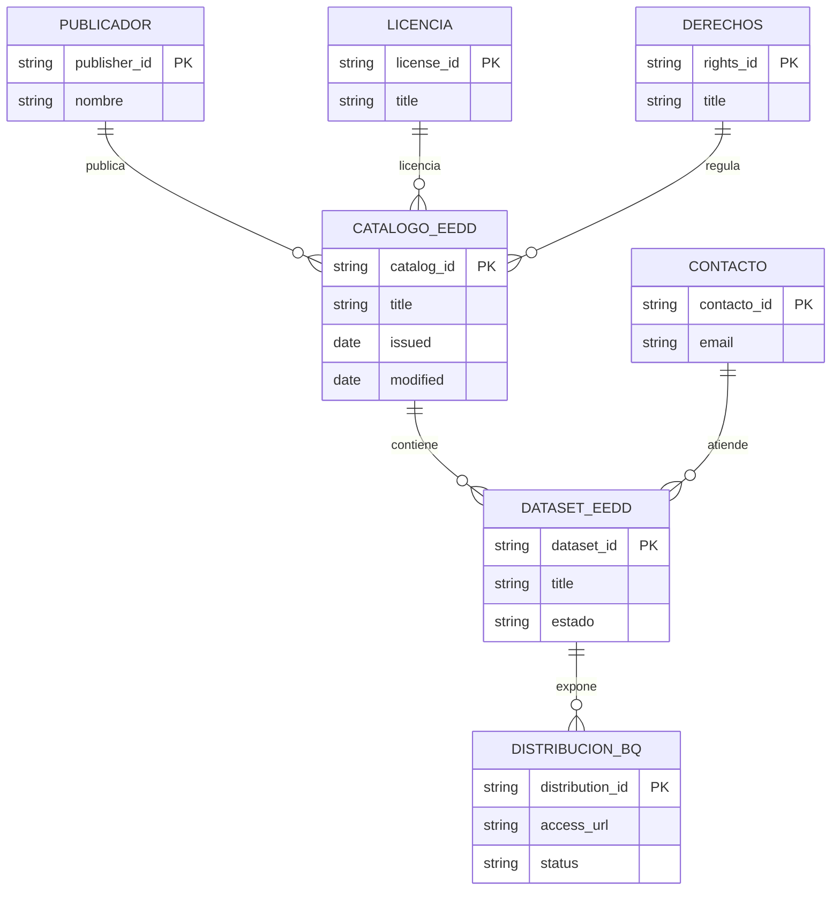

# Catálogo de casos de uso (DCAT)

## Resumen funcional
El fichero `ref_eedd_catalogo_dcat.ttl` implementa un **catálogo DCAT-AP/ES** del EEDD de Vocento,
con cuatro datasets principales:

1. **Audiencias anónimas de publicidad digital**
2. **Intención de compra en automoción**
3. **Suscripciones digitales**
4. **Propuestas comerciales**

Filosofía: publicar productos de datos **privados/no públicos**, sujetos a autorización, contrato
y condiciones específicas de reutilización. Los tres primeros datasets muestran mayor madurez; en
**Propuestas Comerciales** el propio TTL reconoce que la definición está pendiente.

## Arquitectura técnica
Implementación semántica / metadata-first (no un esquema físico de warehouse): formato
**Turtle/RDF**, vocabularios **DCAT, DCT, ADMS, FOAF, VCARD, SKOS**, publicación de datasets y
distribuciones con URLs de BigQuery.

Distribuciones detectadas:

- `dm_eedd_publicidad.cu_eedd_publicidad_digital`
- `dm_eedd_clasificados.cu_eedd_clasificados_intereses_agregados_por_horizonte`
- `dm_eedd_suscripciones.cu_eedd_suscripciones_secciones_clusterizadas`
- `dm_eedd_propuestas_comerciales` (sin tabla final cerrada)

## Modelo entidad-relación
> Traducción del modelo semántico DCAT a entidades lógicas; no representa PK/FK físicas de BigQuery.

Todos los datasets se documentan como **NON_PUBLIC**, bajo licencia y derechos de reutilización
específicos del espacio de datos.

