# Inteligencia de Negocio

## Resumen funcional
Dos frentes: **CdM Inteligencia de Negocio** (fuentes EGM, OJD, I2P y GFK) y **Agente de
Inteligencia de Negocio** (pruebas de calidad/uso sobre esas mismas fuentes).

- **CdM Inteligencia de Negocio**: 4-5 pestañas/fuentes (EGM, I2P, OJD anual, OJD geográfico,
  GFK) donde negocio explota dimensiones + métricas del modelo. Dataset `dm_commercial_intelligence`
  y capa semántica `commercial_intelligence.explore.lkml`.
- **Agente de Inteligencia de Negocio**: responde preguntas sobre OJD/EGM/GFK/I2P; objetivo de
  mejorar calidad de datos y usabilidad de las respuestas.

## Modelo entidad-relación
> Refleja el modelo BI explícito del CdM Inteligencia de Negocio.

```mermaid
erDiagram
    DIM_EGM_OLA {
        string ola_id PK
        string ola_nombre
        date fecha_actualizacion
    }
    DIM_EGM_SOPORTE {
        string soporte_id PK
        string categoria_soporte
        string soporte
    }
    FACT_EGM {
        string ola_id FK
        string soporte_id FK
        string comunidad_autonoma
        string sexo
        string clase_social
        float audiencia_total
    }
    DIM_I2P_ANUNCIANTE {
        string anunciante_id PK
        string anunciante
    }
    DIM_I2P_SECTOR {
        string sector_id PK
        string sector_mhl
        string subsector_mhl
    }
    DIM_I2P_SOPORTE {
        string soporte_id PK
        string soporte
    }
    FACT_I2P {
        date fecha
        string medio_padre
        string medio_hijo
        float inversion
        float paginas
    }
    DIM_OJD_EDITOR {
        string editor_id PK
        string nombre_grupo_editorial
    }
    DIM_OJD_PUBLICACION {
        string publicacion_id PK
        string tipo_medio
        string nombre_publicacion
    }
    DIM_OJD_GEO {
        string geo_id PK
        string provincia
    }
    FACT_OJD_ANUAL {
        int anio
        float tirada_total
        float difusion_total
    }
    FACT_OJD_GEO {
        int anio
        int mes
        float tirada_total
        float difusion_total
    }
    DIM_GFK_MARCA {
        string marca_id PK
        string marca
    }
    DIM_GFK_GEOGRAFIA {
        string geografia_id PK
        string ambito
    }
    FACT_GFK {
        date mes
        int usuarios_unicos
        float audiencia_media_diaria
    }

    DIM_EGM_OLA ||--o{ FACT_EGM : filtra
    DIM_EGM_SOPORTE ||--o{ FACT_EGM : clasifica
    DIM_I2P_ANUNCIANTE ||--o{ FACT_I2P : segmenta
    DIM_I2P_SECTOR ||--o{ FACT_I2P : segmenta
    DIM_I2P_SOPORTE ||--o{ FACT_I2P : segmenta
    DIM_OJD_EDITOR ||--o{ FACT_OJD_ANUAL : agrupa
    DIM_OJD_PUBLICACION ||--o{ FACT_OJD_ANUAL : publica
    DIM_OJD_EDITOR ||--o{ FACT_OJD_GEO : agrupa
    DIM_OJD_PUBLICACION ||--o{ FACT_OJD_GEO : publica
    DIM_OJD_GEO ||--o{ FACT_OJD_GEO : localiza
    DIM_GFK_MARCA ||--o{ FACT_GFK : mide
    DIM_GFK_GEOGRAFIA ||--o{ FACT_GFK : localiza
```

!!! warning "Pendientes/incertidumbres"
    Defectos funcionales abiertos en las pruebas del agente: ruteo incorrecto entre OJD/EGM/GFK,
    redondeos/decimales, ranking print vs digital, manejo de cierres mensuales históricos GFK,
    categorías/segmentos mal interpretados.

!!! info "Fuentes"
    - `4. Documentación Plataforma Tecnológica\7 - Inteligencia Negocio\CdM Inteligencia Negocio.pptx`
    - `4. Documentación Plataforma Tecnológica\7 - Inteligencia Negocio\Revisión CU Agente Int. Negocio.xlsx`
    - `4. Documentación Plataforma Tecnológica\7 - Inteligencia Negocio\Agente_Int_Negocio - Pruebas 25_06.pptx`

