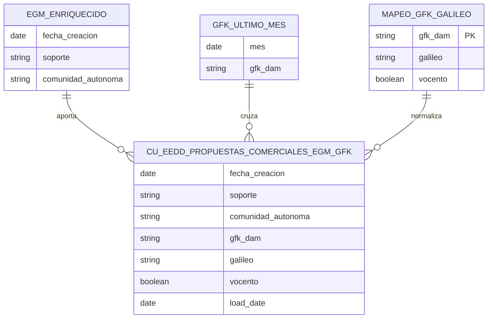

# Propuestas Comerciales

## Resumen funcional
La documentación localizada es **escasa pero consistente**: el objetivo es construir un caso de
uso de propuestas y oportunidades comerciales soportado por un entorno de datos y automatización
de consultas/informes.

- En `Proyecto DATA - Vocento.xlsx` aparece el frente "Propuestas y oportunidades comerciales",
  con dos líneas: **automatización de consultas** (EGM, MAS-i2p, OJD, GFK, AMI, INFOADEX — piloto
  *Be Wise*) y **automatización de informes recurrentes** sobre esas mismas fuentes.
- El catálogo DCAT describe el dataset como "Indicadores de actividad de las propuestas
  comerciales gestionadas por el equipo de ventas de Vocento", con descripción definitiva
  **pendiente**.
- El prototipo técnico más avanzado cruza **EGM + GFK + correspondencias Galileo**, no todo el
  alcance funcional mencionado en el plan.

## Arquitectura técnica
Activo Gold en BigQuery: dataset `dm_eedd_propuestas_comerciales`, tabla
`cu_eedd_propuestas_comerciales_egm_gfk`. El script `deploy_cu_eedd_propuestas.sh` despliega en
**Dataplex Data Quality/Data Profile** un escaneo para esa tabla (proyecto
`prj-dataplatform-dev-vocento`, región `europe-southwest1`).

Columnas del modelo Gold: `soporte`, `comunidad_autonoma`, `fecha_creacion`, `gfk_dam`, `galileo`,
`vocento`, `load_date`, referencia temporal `mes`. Reglas de negocio: solo se publica perímetro
Vocento (`vocento IS TRUE`); comunidad autónoma normalizada; el mes GFK no debe ser posterior a la
fecha de referencia EGM; frescura máxima **48h**.

## Modelo entidad-relación

!!! warning "Pendientes/incertidumbres"
    - Material funcional muy incompleto: no hay memoria de caso de uso, mockup ni SQLX comparable
      a otros dominios.
    - Tensión entre fuentes: el catálogo DCAT lo marca "pendiente/develop" mientras el zip de
      calidad ya presupone una tabla Gold concreta.
    - Fuentes adicionales del plan (MAS-i2p, OJD, AMI, INFOADEX) no se han visto modeladas
      técnicamente en los ficheros localizados.

!!! info "Fuentes"
    - `5. Documentación Espacio Datos\2. Casos de uso\CdU Propuestas Comerciales\Calidad - dm_eedd_propuestas_comerciales.zip`
    - `5. Documentación Espacio Datos\2. Casos de uso\CdU Propuestas Comerciales\gfk_galileo.csv`
    - `4. Documentación Plataforma Tecnológica\6 - Plan Data\Proyecto DATA - Vocento.xlsx`

