# Modelo de datos — Publicidad

> El ER siguiente resume las relaciones más explícitas/localizables en diccionarios, drawios y
> validaciones. En AdPoint existen muchas más tablas `dbo_*` no desglosadas completamente en la
> documentación revisada.

```mermaid
erDiagram
    DIM_COMPANY {
        string company_id PK
        string type
        string name
    }
    DIM_USER {
        string user_id PK
        string email
        string role_name
    }
    DIM_ORDER {
        string order_id PK
        string advertiser_id FK
        string agency_id FK
        string trafficker_id FK
    }
    DIM_AD_UNIT {
        string adunit_id PK
        string adUnitCode
        string parentId
    }
    DIM_DEVICE_CATEGORY {
        string device_category_id PK
        string name
    }
    DIM_CREATIVE_SIZE {
        string creative_size_id PK
        string size
    }
    DIM_PRODUCT {
        string product_id PK
        string product_name
    }
    FACT_DAILY {
        date impressiondate
        string adunit_id FK
        string line_item_id
        string order_id FK
        string device_category_id FK
    }
    MAESTRO_PUBLICACIONES {
        string ADSLOTNAME0 PK
        string Publicacion
        string CABECERA
        string Unidad_Gestion
    }
    DIM_CUSTOMER {
        string customer_id PK
        string customer_name
    }
    DIM_ORDERITEM {
        string orderitem_id PK
        string order_id FK
    }
    DIM_PUBLICATION {
        string publication_id PK
        string publication_name
    }
    DIM_DATE {
        date date_id PK
    }
    FACT_REVENUE {
        string revenuerecognition_id PK
        string customer_id FK
        string order_id FK
        string orderitem_id FK
        string publication_id FK
        date date_id FK
    }
    REF_CU_PUBLICIDAD_SEGMENTOS_IAB {
        string segment_id PK
        string iab_category
        boolean is_active
    }
    CU_PUBLICIDAD_DIGITAL {
        string segmento FK
        int last_1
        int last_7
        int last_15
        int last_30
    }

    DIM_COMPANY ||--o{ DIM_ORDER : advertiser_agency
    DIM_USER ||--o{ DIM_ORDER : gestiona
    DIM_ORDER ||--o{ FACT_DAILY : planifica
    DIM_AD_UNIT ||--o{ FACT_DAILY : inventario
    DIM_DEVICE_CATEGORY ||--o{ FACT_DAILY : dispositivo
    DIM_CREATIVE_SIZE ||--o{ FACT_DAILY : formato
    DIM_PRODUCT ||--o{ FACT_DAILY : clasificacion
    MAESTRO_PUBLICACIONES ||--o{ DIM_AD_UNIT : mapea_adunit

    DIM_CUSTOMER ||--o{ FACT_REVENUE : factura_a
    DIM_ORDER ||--o{ FACT_REVENUE : origen_comercial
    DIM_ORDERITEM ||--o{ FACT_REVENUE : detalle
    DIM_PUBLICATION ||--o{ FACT_REVENUE : publica_en
    DIM_DATE ||--o{ FACT_REVENUE : fecha

    REF_CU_PUBLICIDAD_SEGMENTOS_IAB ||--o{ CU_PUBLICIDAD_DIGITAL : cataloga
```

!!! info "Fuentes"
    - `4. Documentación Plataforma Tecnológica\3 - Publicidad\Publicidad - Medallas & Modelo datos.drawio`
    - `4. Documentación Plataforma Tecnológica\3 - Publicidad\Diccionario\Descripciones_publicidad.xlsx`
    - `4. Documentación Plataforma Tecnológica\3 - Publicidad\Informes de validación de datos\*`
    - `5. Documentación Espacio Datos\2. Casos de uso\CdU Publicidad\Plantilla Metadatos Caso de Uso Publicidad.xlsx`

