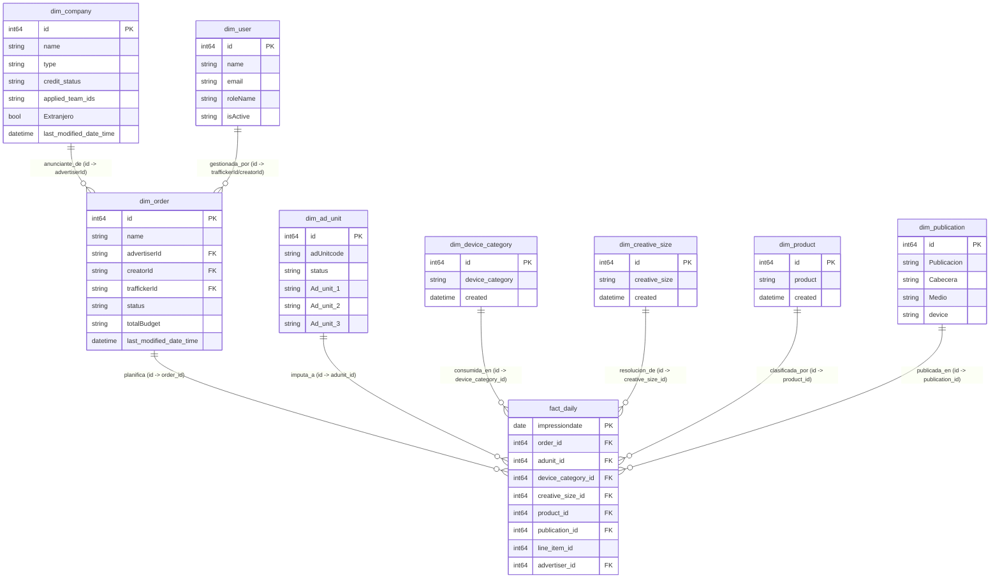
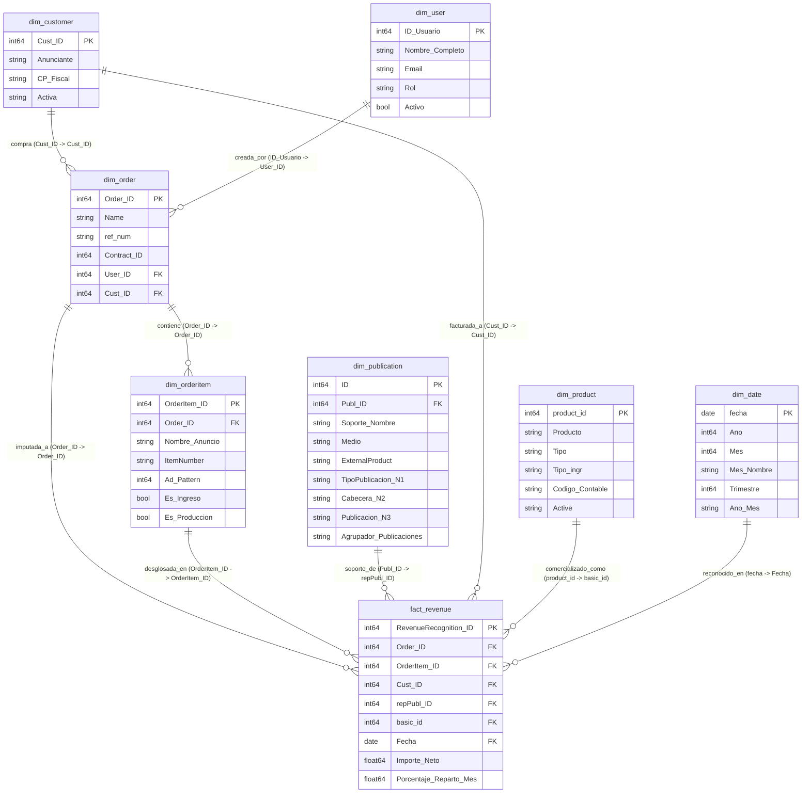
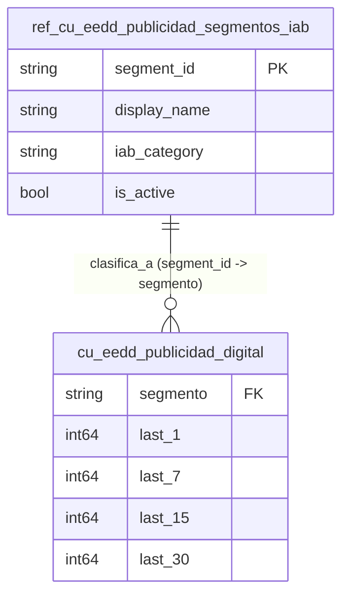

# Modelo de datos — Publicidad

La arquitectura de datos de **Publicidad** en BigQuery se organiza en tres datamarts o esquemas de datos analíticos diferenciados, alojados bajo el proyecto corporativo `prj-dataplatform-prod-vocento`. Cada datamart cumple un propósito funcional específico: la entrega de impresiones publicitarias, el seguimiento de la facturación comercial, y el análisis de audiencias segmentadas.

A continuación, se detallan los diagramas entidad-relación (ER) actualizados de los esquemas reales en BigQuery.

---

## 1. Entrega y Ad Server (`dm_ad_delivery`)

Este datamart procesa las métricas de impresiones y clics diarios procedentes de **Google Ad Manager (GAM)** para cuantificar y auditar la entrega de campañas en los distintos soportes, inventarios y formatos del grupo.

!!! tip "🔍 Modelo interactivo"
    Haz clic sobre el diagrama para abrirlo en pantalla completa en una nueva pestaña. Podrás hacer zoom con la rueda del ratón y arrastrar para moverte.

---

## 2. Gestión Comercial y Facturación (`dm_gestion_comercial`)

Es el esquema analítico responsable del seguimiento de contratos, facturas e imputación de ingresos de publicidad procedentes del ERP comercial **AdPoint**. Cruza anunciantes directos y agencias de medios con las líneas de pedido y su devengo financiero.

!!! tip "🔍 Modelo interactivo"
    Haz clic sobre el diagrama para abrirlo en pantalla completa en una nueva pestaña. Podrás hacer zoom con la rueda del ratón y arrastrar para moverte.

---

## 3. Segmentos de Audiencia - Espacio de Datos (`dm_eedd_publicidad`)

Este esquema expone las categorías y taxonomías IAB en base a los datos de audiencia consolidados del Espacio de Datos (EEDD). Facilita el perfilado de usuarios para la activación de campañas de publicidad digital de alta precisión.

!!! tip "🔍 Modelo interactivo"
    Haz clic sobre el diagrama para abrirlo en pantalla completa en una nueva pestaña. Podrás hacer zoom con la rueda del ratón y arrastrar para moverte.

---

## Orígenes de Datos y Linaje (Pipeline de Negocio)

La consolidación y refinamiento de estos esquemas se orquesta en BigQuery siguiendo tres capas de almacenamiento y transformación:

1. **Capa Bronce (`bronce_publicidad_raw`)**: Contiene la ingesta en bruto (raw replicas) de las APIs diarias de Google Ad Manager y las tablas relacionales procedentes del servidor del ERP comercial AdPoint.
2. **Capa Silver (`silver_publicidad_refined`)**: 
   * Aplica tipados rigurosos, conversiones de zona horaria y limpieza de caracteres especiales de origen.
   * Incorpora un **maestro de publicaciones unificado** (`ficheros_auxiliares_maestro_de_publicaciones_xlsx_hoja1`), que mapea las ad_units físicas del Ad Server con las publicaciones lógicas editoriales del grupo.
3. **Capa Gold (Datamarts `dm_*`)**: Capa semántica de negocio estructurada en modelos estrella (Dimensionales y Hechos) analizados anteriormente, optimizada para su explotación ágil desde **Looker**.

