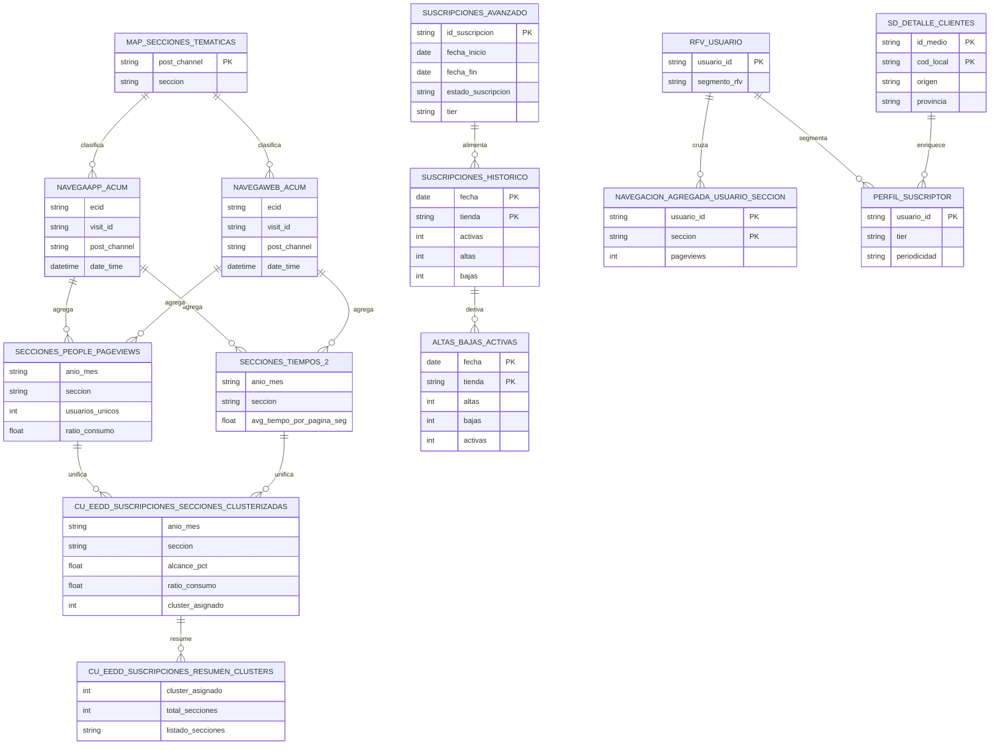

# Modelo de datos — Suscripciones

> El diagrama mezcla tablas físicas (documentadas en validaciones/migración) y entidades lógicas
> intermedias del caso EEDD. Varias relaciones son **inferidas** a partir de comentarios de
> mockups/validaciones, no de un DDL completo — no se ha localizado un diccionario PK/FK completo
> del vertical.

!!! info "Fuentes"
    - `4. Documentación Plataforma Tecnológica\5 - Suscripciones\Definición Reporting\Mockup\Validaciones\validaciones_navegacion_suscriptor.docx`
    - `4. Documentación Plataforma Tecnológica\5 - Suscripciones\Definición Reporting\Mockup\Validaciones\analisis_discrepancia_sd_detalle_clientes.docx`
    - `5. Documentación Espacio Datos\2. Casos de uso\CdU Suscripciones\ENTREGABLE E17 ...docx`

