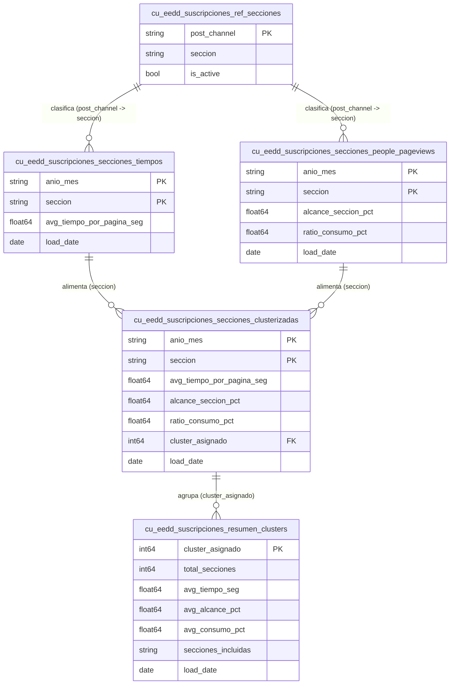
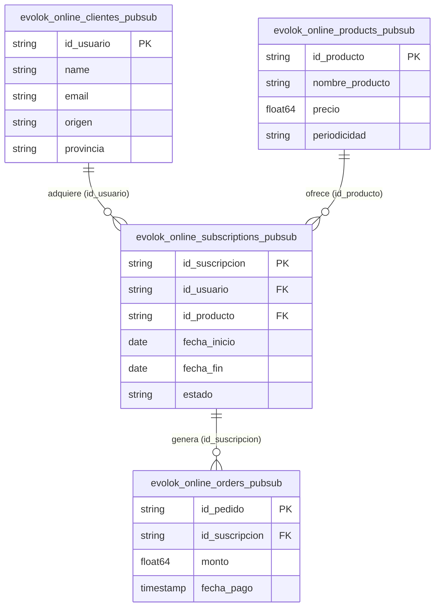

# Modelo de datos — Suscripciones

La arquitectura de datos de **Suscripciones y Clientes** en BigQuery unifica la información transaccional de la pasarela de pago de identidad (**Evolok**) con los modelos analíticos agregados del **Espacio de Datos (EEDD)**. Esta integración permite analizar el comportamiento de navegación de los suscriptores y clusterizar las secciones editoriales según el valor aportado.

A continuación, se detallan los diagramas entidad-relación (ER) actualizados según los esquemas físicos reales que se ejecutan en BigQuery.

---

## 1. Espacio de Datos: Métricas de Consumo y Clústeres (`dm_eedd_suscripciones`)

Este datamart procesa de forma agregada el tiempo medio de permanencia, las páginas vistas y la frecuencia de consumo para agrupar las secciones de los diarios en clústeres temáticos de comportamiento.

!!! tip "🔍 Modelo interactivo"
    Haz clic sobre el diagrama para abrirlo en pantalla completa en una nueva pestaña. Podrás hacer zoom con la rueda del ratón y arrastrar para moverte.

---

## 2. Ingesta Transaccional de Paywall e Identidad (`silver_suscripciones_refined` / `Evolok`)

Este modelo representa el flujo de datos transaccional en tiempo real ingestado a través de Pub/Sub desde la pasarela **Evolok**. Contiene la creación de clientes, gestión de suscripciones activas, pasarela de productos y auditoría de pedidos.

!!! tip "🔍 Modelo interactivo"
    Haz clic sobre el diagrama para abrirlo en pantalla completa en una nueva pestaña. Podrás hacer zoom con la rueda del ratón y arrastrar para moverte.

---

## Orígenes de Datos y Linaje de Suscriptores

El ciclo de vida del dato de suscripciones se divide en los siguientes flujos de procesamiento:

1. **Pasarela Evolok (Capa Bronce & Silver)**:
   * Los eventos de suscripción, productos y usuarios se capturan en tiempo real a través de Google Cloud Pub/Sub, volcándose de manera estructurada en las tablas `evolok_online_*_pubsub` de la capa **Silver** (`silver_suscripciones_refined`).
   * Adicionalmente, se mantiene una réplica relacional histórica importada desde el motor original en la capa **PostgreSQL Evolok** (`postgresql_evolok`), que expone tablas maestros como `detalle_clientes` y `suscripciones`.
2. **Segmentación Web & App (Capa Gold)**:
   * Los flujos de navegación unificados de Adobe Analytics alimentan de manera agregada las métricas de consumo de secciones editoriales.
   * Tras aplicar los pesos del clasificador temático de secciones, el orquestador (Dataform) ejecuta los algoritmos de clústeres analíticos salvando los resultados finales en el datamart del Espacio de Datos: `dm_eedd_suscripciones`.

