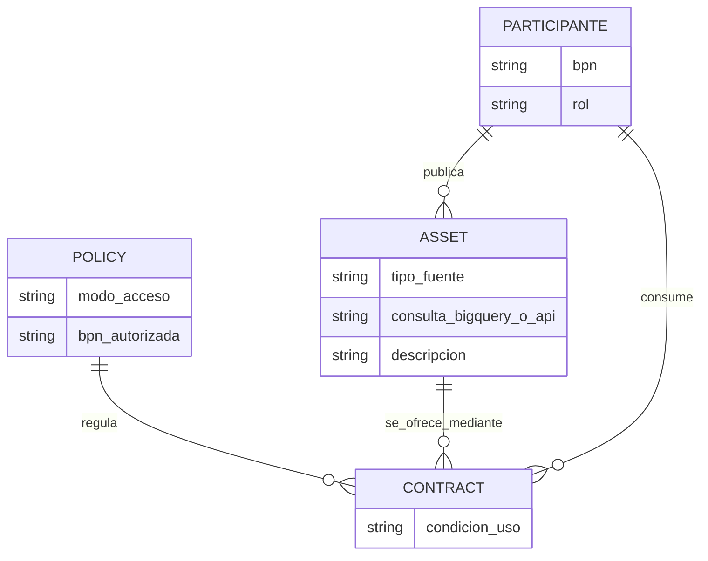
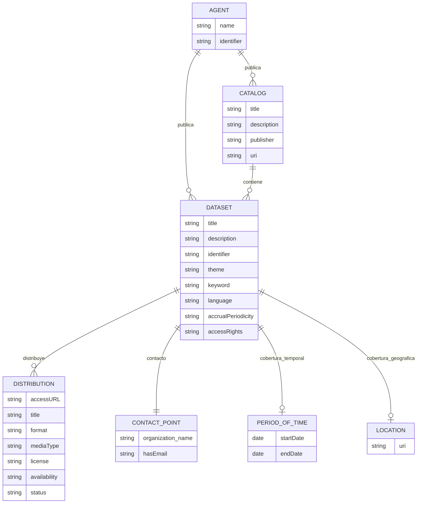
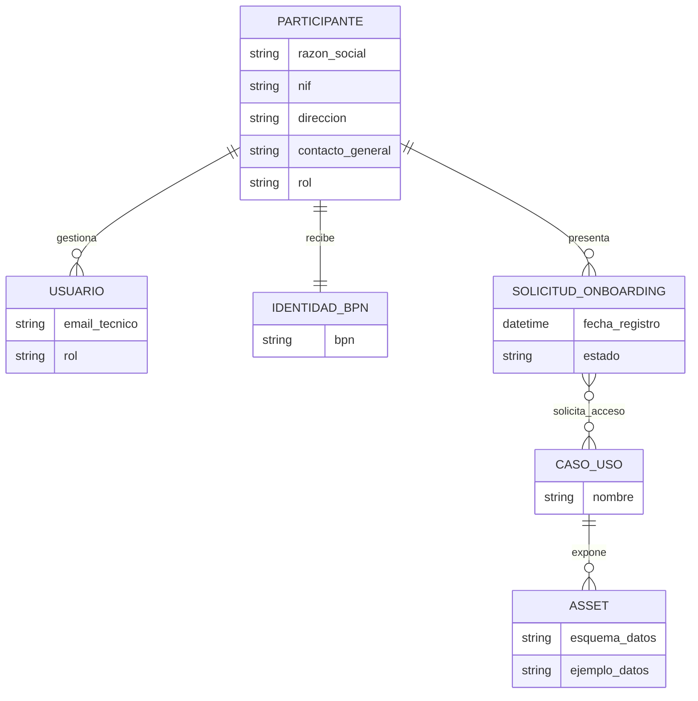
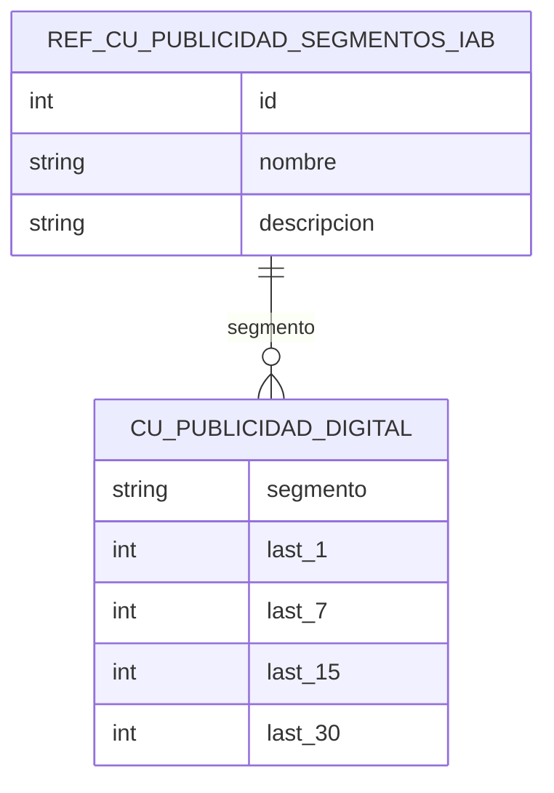
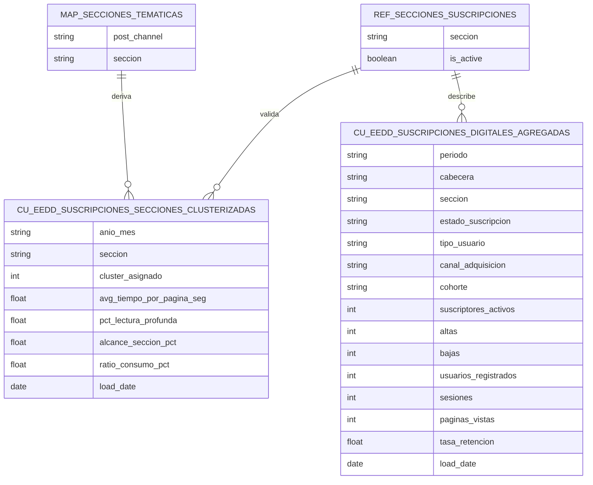
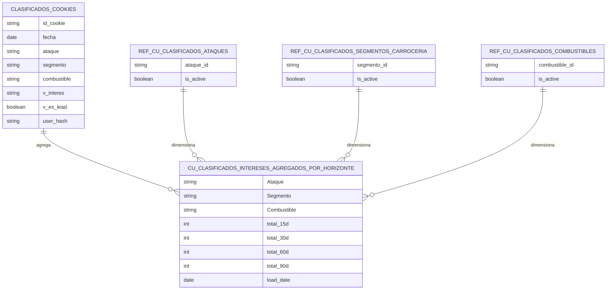
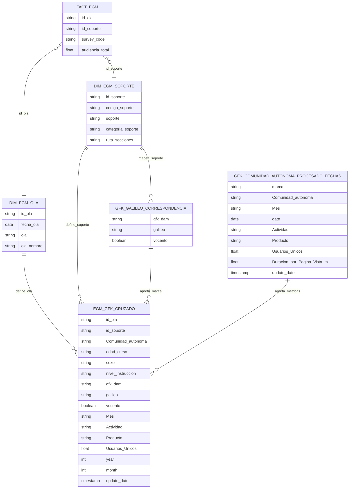

# Memoria Técnica — Entregables E1-E23

Documento de síntesis elaborado a partir de la carpeta compartida `6. Entregables finales Memoria técnica`. Se han priorizado los `.docx` principales de cada entregable; cuando existían versiones iterativas, se ha tomado la más reciente como referencia y se han contrastado el resto. Los `.mp4`/`.mkv` se anotan solo como referencia, sin transcripción.

## E1: Plan de gestión y coordinación del proyecto
**Dominio:** Transversal / Plan Data

**Resumen funcional:** Define la gobernanza operativa del proyecto DATAGORA, la coordinación entre Vocento y partners, el plan de riesgos, el control económico de la subvención y el modelo de seguimiento del valor generado. Sitúa los cuatro casos de uso del programa (Publicidad, Suscripciones, Clasificados y Propuestas Comerciales) y fija responsables de negocio, métricas y cadencias de seguimiento.

**Contenido técnico:** El documento no diseña la solución software, pero sí fija el marco de operación: matriz de riesgos con probabilidad/impacto/mitigación, control presupuestario triple (Memoria, SAP y objetivo teórico), timesheets y seguimiento mensual, gestión del cambio y monitorización de KPIs con BigQuery/Looker. Introduce requisitos de calidad, trazabilidad, seguridad y reporting ligados a la futura plataforma GCP.

**Modelo de datos (si aplica):** No se explicita un esquema tabular reutilizable; predomina la gestión de proyecto, riesgos, gasto y KPIs.

**Fuentes:** `E1 ---- OK\ENTREGABLE E1  Plan de gestión y coordinación del proyecto.docx`

**Notas/pendientes:** El valor está en la PMO y el marco de seguimiento; no aporta modelo lógico detallado de datos de negocio.

## E2: Maestro de Gestión administrativa y de participantes
**Dominio:** Gobierno del Dato / Espacio de Datos

**Resumen funcional:** Establece el marco ético, administrativo, contractual y organizativo del espacio de datos. Incluye plan de responsabilidad social, órganos de gobierno, acta de constitución, código de conducta, principios contractuales y contrato marco de adhesión. El foco es garantizar soberanía del dato, neutralidad, transparencia, cumplimiento RGPD/DGA y reglas comunes de participación.

**Contenido técnico:** Describe roles estandarizados del ecosistema (promotor, autoridad de gobierno, operador, data provider, data consumer e intermediario), comités estratégicos/operativos, rulebook y mecanismos de compliance. No define pipelines ni tablas técnicas, pero sí el modelo organizativo que debe trasladarse a contratos, onboarding y controles de acceso.

**Modelo de datos (si aplica):** No se explicita un ER formal; el documento modela relaciones de gobernanza y responsabilidad más que entidades de datos persistentes.

**Fuentes:** `E2 ---- OK\ENTREGABLE E2  Maestro de Gestión administrativa y de participantes .docx`; `E2 ---- OK\Ejemplo_E2.pdf`

**Notas/pendientes:** Los `.gdoc` del directorio no se han podido explotar. El entregable es normativo/organizativo y no técnico en términos de esquema físico.

## E3: Valoración final de la consecución de los objetivos del proyecto
**Dominio:** Transversal

**Resumen funcional:** Cierra el expediente y valora la consecución de objetivos: espacio de datos soberano, cuatro casos de uso activados, catálogo federado, onboarding, gobierno y plan de explotación. Presenta DATAGORA como un ecosistema operativo para monetización de audiencias, analítica de suscripciones, leads cualificados y propuestas comerciales.

**Contenido técnico:** Consolida la arquitectura realmente ejecutada: DSpacer/EDC, microservicios Python/FastAPI, frontales Angular, Keycloak, Vault, PostgreSQL, GCP, Dataplex, Dataform y BigQuery Gold. Resume la política de privacidad por diseño (k-anonimidad >= 15), la validación E2E, los controles DQ y el pipeline CI/CD con lint, unit, API, integration, coverage, E2E, seguridad y rendimiento.

**Modelo de datos (si aplica):** No introduce un modelo adicional; referencia y sintetiza los modelos de catálogo y de los cuatro data products descritos en otros entregables.

**Fuentes:** `E3\ENTREGABLE E3  Valoración final de la consecución de los objetivos del proyecto .docx`

**Notas/pendientes:** Es un documento consolidado y muy útil para cruzar narrativamente E10-E20, pero no sustituye el detalle de cada caso de uso.

## E4: Definición de la herramienta: alcance, diseño y funcionalidad del espacio de datos
**Dominio:** Espacio de Datos

**Resumen funcional:** Define qué es la “herramienta” del proyecto: un espacio de datos basado en DSpacer v2.0 con tres conectores EDC (1 proveedor y 2 consumidores). Describe cómo los proveedores publican assets, asignan políticas, negocian contratos y exponen datos a consumidores autorizados; y cómo los consumidores descubren, aceptan contratos y descargan datos.

**Contenido técnico:** El alcance funcional se apoya en conectores EDC, catálogo de activos, políticas de acceso, contratos, gestión de identidades y trazabilidad. Los assets pueden definirse desde consultas BigQuery o desde APIs/endpoints externos. El control de acceso puede ser abierto o restringido por BPN. El documento pone el foco en el modelo distribuido y en la soberanía del dato.

**Modelo de datos (si aplica):**

**Fuentes:** `E4 ---- OK\ENTREGABLE E4_ Definición de la herramienta_ Alcance, diseño y funcionalidad del espacio de datos .docx`

**Notas/pendientes:** Modelo funcional, no implementación detallada. No desciende a tablas internas del catálogo o de los microservicios.

## E5: Plan de arquitectura de la solución
**Dominio:** Plataforma Tecnológica

**Resumen funcional:** Define la arquitectura objetivo de la nueva plataforma analítica de datos de Vocento: medallón Landing/Bronze/Silver/Gold, gobierno del dato, explotación analítica y plan de implantación por fases. Sirve como blueprint técnico de la plataforma que alimenta el espacio de datos.

**Contenido técnico:** Detalla la arquitectura lógica y física en GCP: Cloud Storage por capas y verticales, BigQuery como núcleo analítico, Cloud Composer para orquestación, Dataform/SQLX para transformaciones, Dataplex para catálogo/linaje/calidad y Looker Core como capa semántica. Introduce convenciones de datasets (`silver_<vertical>_refined`, `sta_<vertical>`, `dm_<vertical>`), lifecycle rules, particionado, clusterización, controles IAM/RLS y estrategia FinOps.

**Modelo de datos (si aplica):** No se documentan tablas de negocio con campos cerrados; el entregable define zonas, datasets y patrones de modelado dimensional.

**Fuentes:** `E5 ---- OK\ENTREGABLE E5_ Plan de arquitectura de la solución .docx`

**Notas/pendientes:** Muy valioso para entender la arquitectura macro, pero los modelos concretos aparecen más adelante en E16-E19.

## E6: Informe de implementación y configuración de la plataforma
**Dominio:** Plataforma Tecnológica

**Resumen funcional:** Documenta la plataforma ya desplegada en GCP y justifica su viabilidad técnica, operativa y metodológica. Describe cómo Vocento configura la base cloud que soporta ingesta, transformación, explotación, gobierno, observabilidad y control de costes.

**Contenido técnico:** Se detallan VPC, GKE Autopilot, Cloud Composer, BigQuery, Cloud Storage, Secret Manager, Security Command Center, Pub/Sub, Dataflow, Cloud Run Functions, Dataproc y Cloud Build. El despliegue se gobierna con Terraform, naming corporativo (`prj-dataplatform-dev-vocento`, `prj-dataplatform-pro-vocento`, etc.), service accounts, buckets/datasets etiquetados, CI/CD, logging en BigQuery y cuadros FinOps en Looker Studio. También describe el patrón de ingesta por tipos de fuente (FTP/S3/APIs/RabbitMQ/DTS).

**Modelo de datos (si aplica):** No hay un ER de negocio; sí se fijan convenciones físicas de proyectos, buckets, datasets y tablas externas/nativas.

**Fuentes:** `E6 ---- OK\ENTREGABLE E6_ Informe de implementación y configuración de la plataforma .docx`

**Notas/pendientes:** Documento eminentemente de infraestructura y operación, no de dominio funcional de negocio.

## E7: Plataforma de explotación de datos
**Dominio:** BI / Plataforma Tecnológica

**Resumen funcional:** Es el manual conceptual de la plataforma de explotación de datos. Explica cómo se almacenan, procesan, transforman y explotan los datos dentro del ecosistema cloud de Vocento, con foco en trazabilidad, eficiencia operativa y gobierno.

**Contenido técnico:** Recorre Cloud Storage (medallón y buckets por vertical), Cloud Composer y Dataproc para procesamiento batch, BigQuery para datasets analíticos y Dataform para transformaciones/assertions/linaje. Explicita tres niveles de datasets de explotación: `silver_<vertical>_refined`, `sta_<vertical>` y `dm_<vertical>`. Cierra con Secret Manager, Cloud Logging y Cloud Monitoring para seguridad y observabilidad.

**Modelo de datos (si aplica):** No se especifican campos de tablas de negocio; el modelo es de capas/datasets y gobierno técnico.

**Fuentes:** `E7 ---- OK\ENTREGABLE E7 Plataforma de explotación de datos.docx`

**Notas/pendientes:** Referencia no transcrita: `E7 ---- OK\E7- Plataforma de explotación de datos.mp4`.

## E8: Documento de arquitectura del espacio de datos
**Dominio:** Espacio de Datos / Plataforma Tecnológica

**Resumen funcional:** Describe la arquitectura técnica del EEDD de Vocento y sus flujos clave: autenticación, negociación de contratos, transferencia de datos, monitorización y onboarding. Organiza el sistema en tres bloques: conector, módulo de control y servicios transversales.

**Contenido técnico:** Arquitectura basada en DSpacer/EDC, con capas de conectividad/datos, identidad/seguridad, servicios de negocio y frontales. Componentes principales: Conector, Keycloak, Connector Core Service, Login Service, External Storage Service, Aplicación Web del Conector, SSI Wallet, Portal+Onboarding, Servicio de Monitorización y Front del Módulo de Control; más Vault y resto de piezas de soporte. Emplea estándares EDC, OIDC, AAS y JSON-LD, y persigue soberanía, trazabilidad e interoperabilidad.

**Modelo de datos (si aplica):** No expone un modelo relacional; el entregable es de componentes, interfaces y flujos.

**Fuentes:** `E8 ---- OK\ENTREGABLE E8_ Documento de arquitectura del espacio de datos.docx`; `E8 ---- OK\ENTREGABLE E8_ Documento de arquitectura del espacio de datos_v2.docx`; `E8 ---- OK\ENTREGABLE E8_ Documento de arquitectura del espacio de datos_v3.docx`

**Notas/pendientes:** Se ha priorizado la versión `v3`. No se localizan tablas internas persistentes con campos documentados.

## E9: Plan de despliegue y actualización de la infraestructura
**Dominio:** Plataforma Tecnológica

**Resumen funcional:** Define el plan de despliegue, actualización y mantenimiento evolutivo del ecosistema desplegado. Su objetivo es asegurar que conectores y microservicios puedan operar y evolucionar sin interrupciones relevantes.

**Contenido técnico:** Fases entre febrero y abril de 2025: preparación del entorno, acceso a clústeres GKE dev/pro, GSAs con Workload Identity, despliegue de conectores EDC vía Helm, despliegue de microservicios Docker/Kubernetes, Ingress, secretos, rolling updates, SLAs y gestión del riesgo. Incluye estrategia de versionado, separación de configuración sensible y funcional, y mantenimiento preventivo.

**Modelo de datos (si aplica):** No aplica; se documenta infraestructura y procedimiento de despliegue.

**Fuentes:** `E9 ---- OK\ENTREGABLE E9_ Plan de despliegue y actualización de la infraestructura .docx`

**Notas/pendientes:** El cronograma e hitos son claros; no hay modelo de dominio ni esquema físico de datos.

## E10: Documento de definición del catálogo de datos
**Dominio:** Gobierno del Dato

**Resumen funcional:** Define el catálogo de datos publicable del espacio de datos de Vocento. Delimita qué productos de datos entran en catálogo, cómo se describen, cómo se descubren y bajo qué controles pueden solicitarse/consumirse. El catálogo cubre cuatro productos: DP-1 Publicidad, DP-2 Clasificados, DP-3 Suscripciones y DP-4 Propuestas Comerciales.

**Contenido técnico:** El catálogo es la capa de publicación y descubrimiento del EEDD; no transforma datos, sino que documenta y expone metadatos gobernados sobre activos Gold agregados y anonimizados. Se basa en DCAT-AP-ES v1.0.0, UNE 0087:2025, Turtle/RDF y validación SHACL. Se apoya en Dataplex para metadatos de gobierno/linaje/calidad y formaliza clases como `dcat:Catalog`, `dcat:Dataset`, `dcat:Distribution`, `foaf:Organization`, `vcard`, `PeriodOfTime` y `Location`. Distingue visibilidad del metadato frente a derecho efectivo de acceso.

**Modelo de datos (si aplica):**

**Fuentes:** `E10  ---- OK\ENTREGABLE E10  Documento de definición del catálogo de datos .docx`

**Notas/pendientes:** Modelo muy sólido para metadatos y publicación. No sustituye el detalle físico de cada Gold table, que reside en E16-E19.

## E11: Documento de definición del proceso de registro de participantes
**Dominio:** Espacio de Datos / Gobierno del Dato

**Resumen funcional:** Define cómo una entidad se registra y entra en el espacio de datos. La organización interesada consulta el portal y el catálogo federado, solicita adhesión, pasa una evaluación administrativa/técnica y, si procede, recibe alta, contrato y credenciales. Regula normas de participación, identidades y trazabilidad del proceso.

**Contenido técnico:** El onboarding se articula mediante portal web, catálogo federado, workflow de solicitud, revisión por administrador del EEDD y alta final con contrato de adhesión. Se asigna un BPN (Business Partner Number) por participante, se registran logs y se gestionan identidades/accesos centralizados. También enlaza el onboarding con el consumo posterior de assets y casos de uso.

**Modelo de datos (si aplica):**

**Fuentes:** `E11 ---- OK\Entregables_E11.docx`

**Notas/pendientes:** El `.gdoc` de notas no se ha explotado. El proceso se apoya conceptualmente en referencias Catena-X/Tractus-X para BPN e identidad.

## E12: Espacio de datos (manual técnico back-end)
**Dominio:** Plataforma Tecnológica / Espacio de Datos

**Resumen funcional:** Manual técnico del back-end del conector y del ecosistema de microservicios del EEDD. Sirve como guía para desarrolladores, arquitectos y administradores, explicando responsabilidades por capa, endpoints y flujos operativos.

**Contenido técnico:** Describe Conector EDC, Keycloak, Connector Core Service, Login Service, External Storage Service, SSI Wallet, Servicio de Monitorización, Keycloak del módulo de control, Servicio de Onboarding, Servicio Únete, Gestión de Kits, Vault, PostgreSQL y Sub Model Server. Las tecnologías dominantes son Python/FastAPI/Uvicorn, Pydantic, PostgreSQL, Keycloak/OIDC y AAS para representación semántica de activos. Explica flujos de autenticación, descubrimiento, publicación de assets y onboarding.

**Modelo de datos (si aplica):** No hay un ER de negocio; el foco es arquitectura back-end, componentes y APIs.

**Fuentes:** `E12 ---- OK\ENTREGABLE E12_BACK.docx`; `E12 ---- OK\ENTREGABLE E12_BACK_v2.docx`; `E12 ---- OK\ENTREGABLE E12_BACK_v3.docx`; `E12 ---- OK\NOTA Entregables_Vocento.docx`

**Notas/pendientes:** Se ha priorizado la rama `BACK`/`v3`. Referencias no transcritas: `Entregable E12 Video .mp4`, `Entregable E12_FRONT Espacio de datos.mp4`, `VOCENTO_Nueva version_MAYO_V2.mp4`. No se localiza documentación textual equivalente del front-end.

## E13: Resultados de las pruebas de validación realizadas: espacio de datos
**Dominio:** Plataforma Tecnológica / Espacio de Datos

**Resumen funcional:** Documenta el plan de pruebas y la validación integral del EEDD. Aporta evidencia formal de funcionamiento efectivo de los componentes desplegados y de los flujos críticos de negocio.

**Contenido técnico:** Define una estrategia multinivel basada en pirámide de testing y siete tipos de prueba: unitarias, integración, API, E2E, seguridad, rendimiento y smoke/observabilidad. Cubre conectores EDC, Keycloak, Core Service, Login Service, frontales Angular, monitorización, infraestructura Kubernetes, Vault y PostgreSQL. Describe CI/CD con GitHub Actions y herramientas como pytest, FastAPI TestClient, Postman, Cypress/Playwright, OWASP ZAP y k6, además de objetivos de cobertura y criterios de aceptación.

**Modelo de datos (si aplica):** No aplica; es un entregable de aseguramiento de calidad del software.

**Fuentes:** `E13  ---- OK\Entregables_E13.docx`

**Notas/pendientes:** Muy útil para evidenciar madurez operativa, pero no introduce nuevas entidades de negocio.

## E14: Plan de explotación: espacio de datos
**Dominio:** Espacio de Datos / Transversal

**Resumen funcional:** Define el modelo de explotación económica y de gobernanza del espacio de datos. Plantea un enfoque freemium inicial para ganar masa crítica y una evolución posterior hacia monetización por acceso, suscripción o servicios de valor añadido. Identifica participantes potenciales, misión/visión, gobierno y mecanismos de consumo/ingesta.

**Contenido técnico:** Aunque el foco es de negocio, aterriza conceptos técnicos: rulebook, BPN, Keycloak, control de accesos a servicios y APIs, catálogo de activos, publicación/consumo vía API o consultas BigQuery, y monitorización del ecosistema. Reutiliza el marco de roles y comités del EEDD para sostener la explotación futura.

**Modelo de datos (si aplica):** No formaliza tablas con campos; sí define roles, activos, tipos de participante y mecanismos de acceso.

**Fuentes:** `E14 ---- OK\ENTREGABLE E14 Plan de explotación  Espacio de datos.docx`

**Notas/pendientes:** Entregable clave para sostenibilidad, pero más orientado a operating model que a modelado de datos.

## E15: Espacio de datos: solución validada
**Dominio:** Espacio de Datos

**Resumen funcional:** Recoge la ejecución de casos de prueba funcionales/UAT del EEDD con evidencias de validación. Verifica acceso al portal, catálogo, políticas, contratos, BPNs, solicitudes, gestión de casos de uso, monitorización y demás funciones visibles para usuario y administrador.

**Contenido técnico:** El grueso del documento son tablas de ejecución de pruebas `TC-VOC-*` con fecha y estado `PASSED`. Cubre portal, login, catálogo, partners BPN, alta de assets, políticas, contratos, monitoring y creación de casos de uso. Es una evidencia de validación operativa más que un diseño técnico.

**Modelo de datos (si aplica):** No aplica; el entregable es una matriz masiva de pruebas y resultados.

**Fuentes:** `E15 ----- OK\ENTREGABLE E15 Espacio de datos_ Solución validada.docx`; `E15 ----- OK\NOTA Entregables_Vocento.docx`

**Notas/pendientes:** El documento contiene cientos de tablas de pruebas; apenas aporta definición de entidades o campos reutilizables para un ER.

## E16: Solución y resultados de los Casos de uso: Publicidad digital – Audiencias como valor
**Dominio:** Publicidad

**Resumen funcional:** Construye un data product de audiencias anónimas para anunciantes y agencias a partir de navegación digital de Vocento. El objetivo es monetizar first-party data de forma soberana, auditada y compatible con privacidad, aportando segmentos de interés explotables comercialmente y visualizaciones de negocio.

**Contenido técnico:** El flujo unifica Navegaweb/Navegaapp, clasifica intereses con reglas Regex sobre `topics`, `url`, `post_channel` y `titular`, normaliza la capa Silver con `UNPIVOT` y publica una Gold agregada con visitantes únicos por ventanas de 1/7/15/30 días. La taxonomía sigue IAB; el producto se gobierna en Dataplex, se transforma con Dataform, se visualiza en Looker y se expone vía EEDD. La privacidad se blinda con k-anonimidad mínima de 15 usuarios y controles DQ/monitorización.

**Modelo de datos (si aplica):**

**Fuentes:** `E16 ---- OK\ENTREGABLE E16 Solución y resultados de los Casos de uso  Publicidad digital – Audiencias como valor.docx`

**Notas/pendientes:** Referencia no transcrita: `E16 ---- OK\Entregable E16_FRONT Publicidad Espacio de datos.mkv`. El documento aporta ejemplos de segmentos (`VM_*`) y políticas de calidad, pero no detalla la tabla Silver completa.

## E17: Solución y resultados de los Casos de uso: Analítica y activación del dato para aumento del valor del dato de las suscripciones
**Dominio:** Suscripciones

**Resumen funcional:** Construye assets analíticos para mejorar conocimiento, retención y activación sobre la base suscriptora. El caso usa consumo editorial y navegación anónima para entender intereses, tiempos de lectura, penetración de secciones y métricas agregadas del ciclo de vida del suscriptor.

**Contenido técnico:** Se apoya en GCP/BigQuery/Dataform/Dataplex/Looker. Una parte del flujo mapea `post_channel` a secciones temáticas (`map_secciones_tematicas`), calcula tiempos y agrega métricas Gold por mes/sección/cluster; otra define un activo Gold agregado con `periodo`, `cabecera`, `seccion`, `estado_suscripcion`, `cohorte`, altas/bajas, registrados, sesiones, páginas vistas y `tasa_retencion`. El catálogo y la calidad se gobiernan con Dataplex, con reglas sobre rango de porcentajes, actualidad, sección válida, cluster válido y exclusión de secciones técnicas.

**Modelo de datos (si aplica):**

**Fuentes:** `E17 ---- OK\ENTREGABLE E17 Solución y resultados de los Casos de uso_ Analítica y activación del dato para aumento del valor del dato de las suscripciones.docx`

**Notas/pendientes:** Referencia no transcrita: `E17 ---- OK\NOTA Entregables_Vocento.docx` (nota genérica). El documento describe más de un Gold table; parte de los nombres definitivos y owners siguen en maduración.

## E18: Solución y resultados de los Casos de uso: Cualificación de datos para optimización de estrategias de comunicación y de negocio
**Dominio:** Clasificados

**Resumen funcional:** El caso de uso de Clasificados detecta y cualifica intención de compra en automoción (VO y renting) para convertir navegación en señales comerciales accionables. Busca exponer de forma segura recuentos de interés por marca/segmento/combustible, útiles para OEMs, concesionarios, CRM/CDP y analítica comercial.

**Contenido técnico:** Procesa dos ramas (Autoocasión y Rentingcoches) con ventana de 90 días, usa diccionarios maestros y taxonomías como Eurotax para normalizar marca/segmento/combustible, consolida una tabla base `clasificados_cookies` y genera un datamart Gold `cu_clasificados_intereses_agregados_por_horizonte` mediante `GROUP BY CUBE`. Calcula visitantes únicos para 15/30/60/90 días, aplica k-anonimidad (mínimo 15), valida catálogos de dimensión en Dataplex y documenta evidencia real de consumo externo (Omnicom Media, BPN y logs/telemetría).

**Modelo de datos (si aplica):**

**Fuentes:** `E18 ---- OK\ENTREGABLE E18 Solución y resultados de los Casos de uso  Cualificación de datos para optimización de estrategias de comunicación y de negocio.docx`; `E18 ---- OK\E18 - evidencia - Información de Entidad Legal Omnicom Media.pdf`; `E18 ---- OK\E18 - evidencia - Logs y telemetría Conector BPNL00000003AVTH.txt`

**Notas/pendientes:** Referencia no transcrita: `E18 ---- OK\Entregable E18_FRONT Espacio de datos.mkv`. El nombre del entregable es amplio, pero el contenido técnico corresponde claramente al dominio de Clasificados/automoción.

## E19: Solución y resultados de los Casos de uso: Optimización de campañas comerciales a través de los datos
**Dominio:** Propuestas Comerciales / BI

**Resumen funcional:** Construye una solución de inteligencia de audiencias para agencias de publicidad cruzando datos de cobertura EGM, consumo digital GFK, intereses publicitarios y navegación anonimizada. Su objetivo es mejorar planificación, afinidad, cobertura y conversión de campañas a partir de segmentos de alto valor.

**Contenido técnico:** La solución se implementa en GCP con BigQuery, Dataform, Dataplex y Looker. El pipeline: (1) consolida `fact_egm` con `dim_egm_ola` y `dim_egm_soporte`; (2) enriquece soportes con el diccionario `gfk_galileo_correspondencia`; (3) normaliza comunidades autónomas; (4) tipa las fechas de GFK; y (5) cruza EGM con GFK mediante una ventana de asimetría temporal que asigna a cada ola el último dato digital disponible anterior. El asset final incluye campos demográficos, cobertura, marca/soporte, producto y métricas digitales. Hay una muestra extensa en el TXT adjunto.

**Modelo de datos (si aplica):**

**Fuentes:** `E19 ---- OK\ENTREGABLE E19 Solución y resultados de los Casos de uso  Optimización de campañas comerciales a través de los datos.docx`; `E19 ---- OK\ENTREGABLE E19  Muestra asset propuestas comerciales.txt`

**Notas/pendientes:** La muestra tabular aporta campos, pero no documenta exhaustivamente todas las métricas GFK posibles (en el TXT aparecen más columnas que en la tabla-resumen del DOCX). `NOTA Entregables_Vocento.docx` es una nota genérica y no añade modelo.

## E20: Plan de consultoría y apoyo a empresas participantes
**Dominio:** Transversal

**Resumen funcional:** Define el marco documental y metodológico para acompañar a empresas interesadas en el EEDD de Vocento. Prevé dossiers, one-pagers, presentaciones ejecutivas, guías de incorporación y materiales prácticos para reducir barreras de entrada y acelerar la adopción.

**Contenido técnico:** No entra en diseño técnico profundo; sí aterriza cómo explicar casos de uso, catálogo, onboarding, publicación/descubrimiento de datos y buenas prácticas de preparación del dato. Funciona como capa de enablement y transferencia hacia participantes potenciales.

**Modelo de datos (si aplica):** No aplica; el entregable es de acompañamiento y soporte.

**Fuentes:** `E20 ---- OK\Entregables_E20.docx`

**Notas/pendientes:** El valor está en la adopción y extensión a nuevos participantes, no en el modelado de datos.

## E21: Plan de comunicación
**Dominio:** Transversal

**Resumen funcional:** Organiza la difusión interna y externa del proyecto entre abril y julio de 2026. Incluye newsletter interna, campaña print/digital, redes sociales, contenido editorial, evento propio y acciones para captar partners y consolidar visibilidad del espacio de datos.

**Contenido técnico:** No aporta arquitectura de datos, pero sí evidencia el packaging narrativo de los cuatro casos de uso y el pipeline comercial/comunicacional de nuevos interesados. Centraliza mensajes de valor, públicos objetivo, calendario y canales empleados.

**Modelo de datos (si aplica):** No aplica.

**Fuentes:** `E21\Modelo_Entregables_E21.docx`

**Notas/pendientes:** Entregable de comunicación y transparencia regulatoria; no contiene esquemas de datos.

## E22: Generación de herramientas de apoyo
**Dominio:** Transversal

**Resumen funcional:** Describe las herramientas visuales y documentales creadas para apoyar comunicación y entendimiento del proyecto: plan de comunicación, piezas publicitarias, infografía, newsletter y manual de uso. Busca alinear equipos internos y hacer comprensibles los casos de uso hacia usuarios/clientes.

**Contenido técnico:** La parte más técnica es la infografía, que conecta fuentes de información, procesos ETL y outputs de negocio. No documenta tablas nuevas, pero sí resume visualmente la arquitectura y los flujos del proyecto.

**Modelo de datos (si aplica):** No aplica; no hay definición tabular ni entidades persistentes nuevas.

**Fuentes:** `E22\Modelo_Entregables_E22.docx`

**Notas/pendientes:** Es un entregable de soporte visual y lecciones aprendidas, no de diseño lógico.

## E23: Página web para publicación de resultados obtenidos y publicación de catálogos de recursos
**Dominio:** Transversal

**Resumen funcional:** Define el espacio web corporativo creado para publicar resultados, casos de uso y recursos del proyecto. Centraliza en un único enlace la difusión de los cuatro casos y de los resultados finales, y plantea la publicación de catálogos de recursos para equipos técnicos y de negocio.

**Contenido técnico:** El documento principal describe el portal de resultados y la idea de catálogo de recursos. Los documentos auxiliares “(EJEMPLO DELOITTE NOTAS)” son plantillas: una ficha genérica de catálogo de recursos y una plantilla de resultados del proyecto con placeholders. Por tanto, el contenido técnico real de E23 es más de publicación/diseminación que de catálogo operativo implementado.

**Modelo de datos (si aplica):** No se consolida un modelo de datos definitivo; solo aparece una plantilla de ficha de recurso con campos como tipo de recurso, formato/interfaz, mecanismo de acceso, proveedor y estándar/modelo de datos.

**Fuentes:** `E23\Modelo_Entregables_E23.docx`; `E23\(EJEMPLO DELOITTE NOTAS) - Catálogo de recursos.docx`; `E23\(EJEMPLO DELOITTE NOTAS) - Resultados del Proyecto.docx`

**Notas/pendientes:** Los dos documentos de ejemplo son claramente plantillas/placeholder, no evidencias finales cerradas. Conviene tratarlos como apoyo conceptual, no como catálogo productivo definitivo.

## Índice de entidades detectadas

### Metadatos y catálogo (E10)
- `CATALOG`: `title`, `description`, `publisher`, `uri`
- `DATASET`: `title`, `description`, `identifier`, `theme`, `keyword`, `language`, `accrualPeriodicity`, `spatial`, `accessRights`, `contactPoint`, `issued`, `modified`, `conformsTo`
- `DISTRIBUTION`: `accessURL`, `title`, `description`, `format`, `mediaType`, `license`, `availability`, `status`
- `AGENT/ORGANIZATION`: `name`, `identifier`
- `CONTACT_POINT`: `organization_name`, `hasEmail`
- `PERIOD_OF_TIME`: `startDate`, `endDate`
- `LOCATION`: `uri`

### Onboarding y participación (E11)
- `PARTICIPANTE`: `razon_social`, `nif`, `direccion`, `contacto_general`, `rol`
- `USUARIO`: `email_tecnico`, `rol`
- `IDENTIDAD_BPN`: `bpn`
- `SOLICITUD_ONBOARDING`: `fecha_registro`, `estado`
- `CASO_USO`: `nombre`
- `ASSET`: `esquema_datos`, `ejemplo_datos`

### Publicidad (E16)
- `REF_CU_PUBLICIDAD_SEGMENTOS_IAB`: `id`, `nombre`, `descripcion`
- `CU_PUBLICIDAD_DIGITAL`: `segmento`, `last_1`, `last_7`, `last_15`, `last_30`
- Señales Silver citadas: `topics`, `url`, `post_channel`, `titular`

### Suscripciones (E17)
- `MAP_SECCIONES_TEMATICAS`: `post_channel`, `seccion`
- `REF_SECCIONES_SUSCRIPCIONES`: `seccion`, `is_active`
- `CU_EEDD_SUSCRIPCIONES_SECCIONES_CLUSTERIZADAS`: `anio_mes`, `seccion`, `cluster_asignado`, `avg_tiempo_por_pagina_seg`, `pct_lectura_profunda`, `alcance_seccion_pct`, `ratio_consumo_pct`, `load_date`
- `CU_EEDD_SUSCRIPCIONES_DIGITALES_AGREGADAS`: `periodo`, `cabecera`, `seccion`, `estado_suscripcion`, `tipo_usuario`, `canal_adquisicion`, `cohorte`, `suscriptores_activos`, `altas`, `bajas`, `usuarios_registrados`, `sesiones`, `paginas_vistas`, `tasa_retencion`, `load_date`
- Glosario funcional detectado: `suscriptor_activo`, `alta`, `baja`, `churn`, `retencion`, `usuario_registrado`, `cabecera`, `seccion_editorial`, `canal_adquisicion`

### Clasificados / automoción (E18)
- `CLASIFICADOS_COOKIES`: `id_cookie`, `fecha`, `ataque`, `segmento`, `combustible`, `v_interes`, `v_es_lead`, `user_hash`
- `CU_CLASIFICADOS_INTERESES_AGREGADOS_POR_HORIZONTE`: `Ataque`, `Segmento`, `Combustible`, `total_15d`, `total_30d`, `total_60d`, `total_90d`, `load_date`
- `REF_CU_CLASIFICADOS_ATAQUES`: `ataque_id`, `is_active`
- `REF_CU_CLASIFICADOS_SEGMENTOS_CARROCERIA`: `segmento_id`, `is_active`
- `REF_CU_CLASIFICADOS_COMBUSTIBLES`: `combustible_id`, `is_active`
- Conceptos de negocio documentados: `visitante_unico`, `lead_cualificado`, `grupo_de_ataque_competitivo`, `segmento_de_carroceria`, `tipo_de_combustible`, `umbral_de_privacidad`, `ventana_temporal`, `hash_email`

### Propuestas comerciales / inteligencia de audiencias (E19)
- `FACT_EGM`: `id_ola`, `id_soporte`, `survey_code`, `audiencia_total`
- `DIM_EGM_OLA`: `id_ola`, `fecha_ola`, `ola`, `ola_nombre`
- `DIM_EGM_SOPORTE`: `id_soporte`, `codigo_soporte`, `soporte`, `categoria_soporte`, `ruta_secciones`
- `GFK_GALILEO_CORRESPONDENCIA`: `gfk_dam`, `galileo`, `vocento`
- `GFK_COMUNIDAD_AUTONOMA_PROCESADO_FECHAS`: `marca`, `Comunidad_autonoma`, `Mes`, `date`, `Actividad`, `Producto`, `Usuarios_Unicos`, `Audiencia_Media_Diaria`, `Ratio_de_stickiness`, `Cobertura`, `Sesiones`, `Paginas_Vistas`, `Duracion_por_UU_segundos`, `Duracion_por_Pagina_Vista_m`, `year`, `month`, `cierre_mes`, `update_date`
- `EGM_GFK_CRUZADO`: combinación de campos EGM + GFK ya homogeneizados (`id_ola`, `id_soporte`, `Comunidad_autonoma`, `edad_curso`, `sexo`, `nivel_instruccion`, `gfk_dam`, `galileo`, `vocento`, `Mes`, `Actividad`, `Producto`, `Usuarios_Unicos`, `year`, `month`, `update_date`, etc.)

### Activos/objetos técnicos recurrentes detectados en varios entregables
- `ASSET` del EEDD: recurso publicado por un proveedor, asociado a política y contrato
- `POLICY`: reglas de acceso (abierto o restringido por `BPN`)
- `CONTRACT`: acuerdo de intercambio de datos
- `BPN`: identificador único del participante
- `Gold table / Data Product`: representación agregada, gobernada y publicable
- `Data Quality / DataScan`: artefactos de control de calidad y observabilidad exportados a BigQuery/Dataplex
